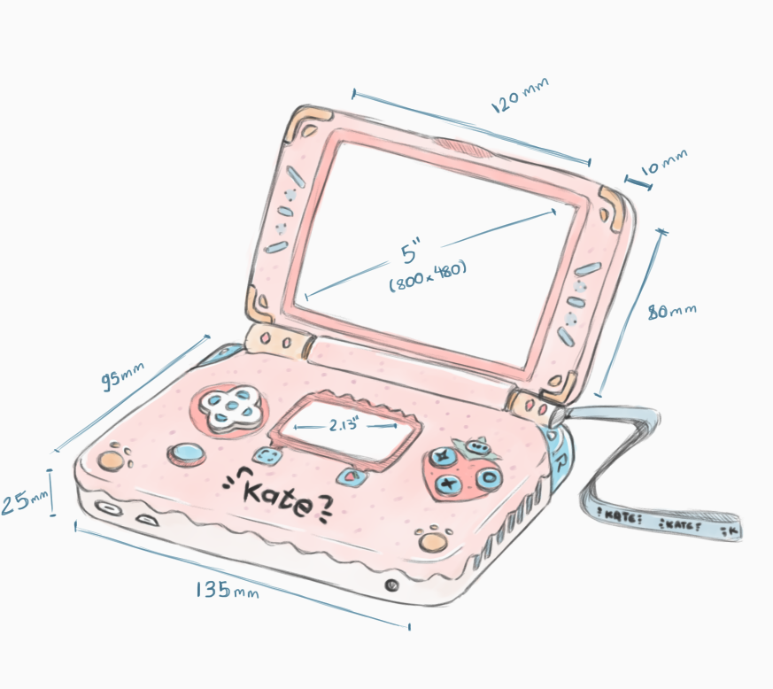

# Kate

> **NOTE:** Kate is an experimental proof-of-concept currently, expect it to randomly break on every new release (or, like, just on a regular usage). Cartridge format is not final and old binaries will not work on version changes.

Kate is a fantasy handheld console designed for simpler story-rich games, like Visual Novels and 2d RPGs. It looks like an old handheld, but runs on Windows, Mac, Linux, or in your browser. That way, you can easily and **safely** share small games as a single file that can run anywhere; and players can install and play it without worrying too much about security, since it's all sandboxed!

You can dive into more details about the concept and technical specifications on [Kate's Concept Paper](./docs/CONCEPT.md). To understand more about what technology powers Kate, and what guarantees you can expect from it, see the [Kate's Underlying Technology](./docs/TECHNOLOGY.md) page.

You can try Kate directly from your web-browser: go to https://kate.qteati.me/ and install the `hello.kart` file provided in this repository by drag-dropping it over the console.



## Specifications

|                          |                                                               |
| ------------------------ | ------------------------------------------------------------- |
| **Display**              | 800x480 — a 5:3 screen                                        |
| **Cartridge size limit** | 512mb                                                         |
| **Input**                | D-pad, O, X, L, R, Menu, and Capture (6 buttons), multi-touch |

## Default input configuration

| **Kate** | **Common uses**                                   | **Keyboard** |
| -------- | ------------------------------------------------- | ------------ |
| D-pad    | Navigation, directional input                     | arrow keys   |
| O        | Confirm selection, Ok                             | Z            |
| X        | Cancel selection, alternate input                 | X            |
| L        | Previous page                                     | A            |
| R        | Next page                                         | S            |
| Menu     | Contextual menu, long-press for OS menu           | left Shift   |
| Capture  | Take a screenshot, long-press for recording video | left Ctrl    |

## Hacking on Kate

The core of Kate is written in [TypeScript](https://www.typescriptlang.org/), some tools are written in [Crochet](https://crochet.qteati.me/). To build Kate you'll need at least a working [Node.js](https://nodejs.org/en/) environment.

Setup things with:

```shell
$ npm install
$ node make all
```

After this you should have a working Kate. You can either use `node make desktop:run` to run it as an Electron app, or start a server on the `www` folder and point a modern browser there.

You should see a screen similar to the screenshot above, but without any cartridges. Drag the `hello.kart` file from the `examples/` folder and drop it over the console to install it. Then either click the game or use the keyboard/virtual buttons to play.

## Examples

See the `examples/` folder in this repository for some example games. You can build all of them into cartridges by running `node make example:all`.

- [**Hello, from Kate**](examples/hello-world/): A hello-world type demo that shows what keys you're pressing (uses the `input` API).

- [**Boon-scrolling**](examples/boon-scrolling/): A small "doom-scrolling" simulation with procedural generation (uses the `cart_fs`, `audio`, and `input` APIs, as well as the `domui` library for UI).

## Cartridges and runtime

Kate games are packaged as a single `.kart` binary file. This file contains something that can run in a webbrowser, a specification of which runtime it needs to use, some meta-data, and a set of arbitrary files in a read-only file-system. In that sense, it's much like a `.tar` or `.zip` file, just without compression and with some additional meta-data for the console.

Currently the only supported runtime is `Web Archive`, which means you provide an HTML entry point and Kate will display that page in the console in a [fully sandboxed IFrame](https://developer.mozilla.org/en-US/docs/Web/HTML/Element/iframe#attr-sandbox) with JavaScript support.

This means no access to things like `fetch` or even loading images. In order to remediate that, Kate provides an IPC layer that allows this sandboxed process to do things—by posting messages to the parent window, and handling messages sent by the parent window.

Web APIs can be emulated through what Kate calls "bridges": small scripts injected into the page that replace common Web APIs with an implementation over Kate's IPC, so the game in question doesn't need to be Kate-aware.

By doing this, there's also no need for a web-server. Games can be played locally using all standard web technologies (and some enhanced Kate ones), and without worrying about network latency when loading resources. Players on the other hand enjoy the same benefits of regular executables without having to worry about sandboxing them themselves, or playing them in a different machine.

You build these `.kart` files using the included `kate-packaging` (`kart`) application, providing it with a JSON configuration file and an output location. For safety the cartridge can only include files that are contained in the directory of the JSON file.

See the `hello-world` example cartridge for some practical example of how this all works.

## Roadmap

The first public release of Kate is planned for this year, targeting webkit/Electron, and with the following features:

- [x] Running web-based games;
- [x] Gamepad support;
- [ ] In-cartridge digital game booklets & box art for that nostalgia feel;
- [x] Uninstalling cartridges;
- [ ] Screen capture;
- [ ] Media gallery (screenshots only);
- [ ] Cartridge permissions;
- [ ] Electron-based executable;

Future planned features:

- **Additional APIs**:
  - [ ] Touch-input support;
  - [ ] Keyboard/Virtual keyboard input for text;
  - [ ] Haptic feedback/vibration;
  - [ ] Object store API (flat, tag-based file system);
  - [ ] Object database API (IndexedDB-like);
  - [ ] Badges/achievements API;
  - [ ] Networking API;
  - [ ] Improved audio API (effects, graphs, etc);
  - [ ] Screen recording/capture API;
- **KateOS UI improvements**:
  - [ ] Reconfiguring keybindings;
  - [ ] Tracking play times locally;
  - [ ] Game collections and filtering;
  - [ ] Browsing cartridges' object store/key-value store;
  - [ ] Extending media gallery to videos;
  - [ ] OST player for cartridges;
  - [ ] "Store", for finding games in connected distributed repositories;
  - [ ] Audit, for auditing security logs/actions in the console;
- **Supporting games not designed for Kate**:
  - [ ] Proxying HTML Audio/Web Audio APIs;
  - [ ] Proxying IndexedDB API;
  - [ ] Full support for RPG Maker MV games;
  - [ ] Full support for Ren'Py games;
- **Supporting tooling**:
  - [ ] Kate IDE, a fully integrated way of building Kate games;
- **Additional platforms**:
  - [ ] Android (partial support currently);
  - [ ] iPhone (bad partial support currently);
  - [ ] iPad (unknown support);
  - [ ] Non-webkit browsers (unknown support);

## Licence

Copyright (c) 2023 Q.
Licensed under the permissive MIT licence.
