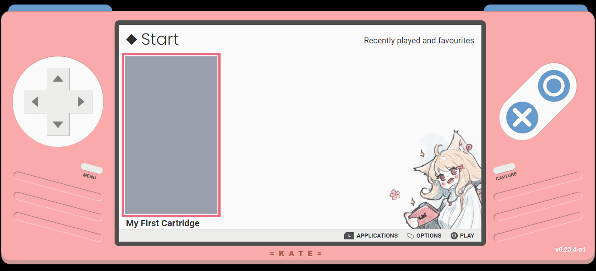
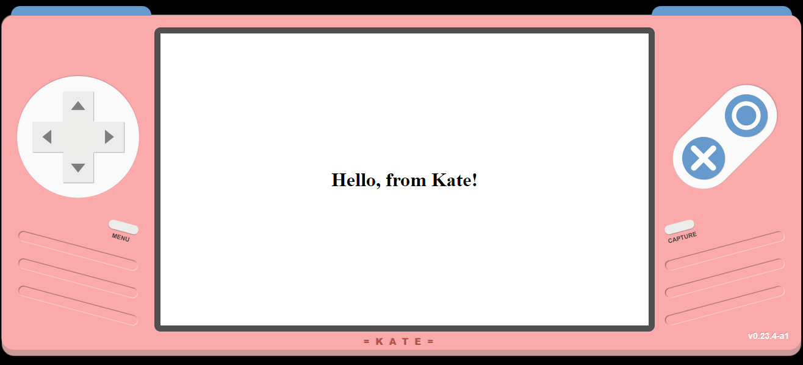

# Making games for Kate!

> **NOTE**: This is a living document. Information here applies to Kate v0.23.4

Kate is a fantasy hand-held console for small 2d applications, particularly RPGs, Visual Novels, and similar story-driven games. You can build real games that run in the console, which you distribute to your players as a single `.kart` file they can install and run offline, at their convenience, in any device.

Kate supports Windows, Linux, and MacOS natively, and supports many other platforms with a modern web-browser (e.g.: iOS and Android). When programming for Kate you program for a single platform, distribute a single file, and allows players to run the game anywhere, as well as synchronise their data among their devices, without any additional programming on your side.

This manual describes how to make games for Kate with a hands-on approach, as well as diving into some of its technical details and approach to security and privacy.

For an end-user documentation, see [The Kate Manual](./user-manual.md).

## Before you start

### What's Kate and why should I care?

Kate is a fantasy console. This essentially means that while the hardware specifications are real, there is no off-the-shelf device that users can buy from a store. Rather, users will mostly be running an emulator for the real Kate device on their computer (or phone/smartdevice). Think of how people can run games made for 90s and 00s era consoles in their desktop computers nowadays; Kate is similar.

But unlike most commercial consoles, Kate is first and foremost a platform _for players_. This means that we want to respect their security, privacy, and agency as much as possible. We want players to be able to download any random game they find on the internet and run it, safely, even if the game turns out to be malicious in the end. Kate goes to great lengths to make this possible, through sandboxing. We'll come back to this later.

As a developer, by making a game for Kate you get to:

- Distribute your game as a single file, which users can install and play offline in any platform the Kate emulator runs on;

- Avoid players being overly cautious of downloading a small game packaged as a native executable because they have been a victim of malware before;

- Have the option of package the emulator with your game as a webpage, which can then be used to provide a web-playable version in a platform like Itch.io, or on your own site;

- Use the same game making tools you're already familiar with, as long as they have an option to make a web export; and

- Avoid having to deal with optimising download sizes for your files so players don't have to wait a long time to start the game.

On top of the APIs that the are provided in the web platform, Kate adds its own game-specific APIs that have a baseline expectation among players, so you don't have to keep re-explaining yourself.

These APIs include things like safe additional storage for your save data, support for screenshot and video capture of game-play, simplified input handling where you don't need to care if the player is using a touch-screen, a keyboard, a gamepad, or another device, etc.

### What will I need?

The tools used to package Kate games currently require [Node.js](https://nodejs.org/en) to be installed, so you will need a device capable of installing it. Node.js supports Windows, MacOS, and Linux.

You'll also need to be familiar with [the command line](https://en.wikipedia.org/wiki/Command-line_interface) and with the basics of [web development](https://developer.mozilla.org/en-US/docs/Learn).

There's a planned tool called Kate Studio which will allow you to build games for Kate directly from your browser, but that tool is not here yet.

Once you have Node.js installed, you can install the set of tools for building and running Kate games from the command line:

```shell
$ npm install -g @qteatime/kate-tools@experimental
$ npm install -g @qteatime/kate-desktop@experimental
```

> **NOTE:**  
> The `$` just indicates that you should run these commands as your user, not with the administrator account. You should not type the `$` when running these commands.
>
> Also note that running commands with an administrator account is far too dangerous, and should not be done without understanding the consequences. Make sure you're running your command line shell (such as PowerShell, CMD, or Bash) as a regular user!

After you run these commands you should have three new applications available in the command line:

- **kart** is used for packaging your games into a single `.kart` file that you can distribute to players;
- **kate-dist** is used for bundling a `.kart` file and the Kate emulator into a web page, which you can then upload to a platform like Itch.io. You'll need to zip the contents of the generated folder separately.
- **kate-desktop** is the native version of the Kate emulator, which you'll use to test your games. You can also test it by accessing the online version at https://kate.qteati.me, which is useful if you want to check how your game runs on an iPhone, iPad, or Android device.

## Getting started

To follow along you'll only need a text editor (such as [Visual Studio Code](https://code.visualstudio.com/)) and the Kate Tools package.

### Your first cartridge

Let's start by just trying to get something to show up on the screen, to make sure everything is set up correctly and your Kate emulator can play games.

To begin with we'll create an HTML page. All Kate cartridges eventually start there, since the console is based on the web platform.

Create a file called `index.html` in your text editor with the following contents:

```html
<!DOCTYPE html>
<html>
  <head>
    <style>
      body {
        margin: 0;
        padding: 0;
        width: 100vw;
        height: 100vh;
        display: flex;
        align-items: center;
        justify-content: center;
        background: white;
        color: black;
      }
    </style>
  </head>
  <body>
    <h1>Hello, from Kate!</h1>
  </body>
</html>
```

If you open your `index.html` on a web-browser, you should see something similar to the image below:


Not very exciting, but hey, baby steps!

Now, we want to turn this into a Kate cartridge, which we can then install in a Kate emulator to play. To do so we'll need to create a file describing the cartridge, so the `kart` tool can do its magic.

Create a file called `kate.json`, in the same folder as your `index.html`, with the following contents:

```json
{
  "id": "my-namespace/my-first-cartridge",
  "metadata": {
    "game": {
      "title": "My First Cartridge"
    }
  },
  "files": ["index.html"],
  "platform": {
    "type": "web-archive",
    "html": "index.html"
  }
}
```

This file tells Kate that there's a game identified by `my-namespace/my-first-cartridge`. This identification **must** be unique, and we'll get into what that means later.

We also provide a more readable title, `My First Cartridge`. This is what players will see in the cartridge selection screen.

Next we tell Kate what is actually in the cartridge. Our cartridge so far is made up of a single file, `index.html`, and in order to play this file we tell Kate to use the `web-archive` format—meaning Kate will treat it as if it was a web page (of sorts). This `web-archive` format requires us to specify which web page Kate should load first; we only have one, so `index.html` it is.

With all the incantations in place, what's left is asking the `kart` application to turn this configuration into an actual cartridge. You do so by running the following command from the same directory your `kate.json` and `index.html` files are:

```shell
$ kart kate.json --output my-first-cartridge.kart
```

> **NOTE:**  
> If you're using PowerShell on Windows 10+, depending on your security settings you might see a message like the following:
>
>     kart : File C:\<...>\kart.ps1 cannot be loaded
>            because running scripts is disabled on this
>            system. For more information, see
>            about_Execution_Policies at https://...
>
> PowerShell has more restricted rules on script execution (which is good, though it would be less needed if they were sandboxed from the beginning), and the Kate Tools scripts are not signed. You **are** encouraged to review the code on https://github.com/qteatime/kate/tree/main/packages/kate-tools and at the location Windows is pointing you to, if you've installed it through `npm`.
>
> Rather than disabling PowerShell's security rules (Don't do that arbitrarily! Security rules exist for a reason!), you _may_ choose to run `kart.cmd` instead of `kart`, as a workaround, since it is not covered by the same security rules. However, once again, **you are encouraged to review your tools' code**.
>
> Arbitrarily running applications in an unsandboxed system, like Windows, can easily get your computer compromised (and risks damaging your reputation if that ends up with you distributing malware to your users unknowingly). Kate is a secure platform, and part of that security also comes from knowing what your applications are doing :)

This should create a `my-first-cartridge.kart` file in the same folder as your `kate.json` and `index.html` files. Drag and drop it on your Kate emulator (either by accessing https://kate.qteati.me/ or by running `kate-desktop` in the command line) to install. Your emulator should look like this:



And if you click (or press ) to play it, your emulator should look like this:



From here you can try [porting a game you already have to Kate](#porting-to-kate).

## Porting to Kate

Chances are you already have a game that runs on Kate—if it runs on a web browser, there are high chances it's supported in Kate as well. Just note that if you use more dangerous/privacy-concerning APIs (like geolocation), then Kate does not offer support for it currently.

So, what goes into porting a game for Kate? Here's a small checklist:

- **Can you map your game's controls to Kate's input buttons?** — Kate only has a D-Pad and the buttons O, X, L, R, and Menu usable by your game. That's a total of 9 buttons you can map. If your game has complex controls or relies on a touch screen instead of a gamepad, it might be difficult to port.

  Touch support is coming in a future version, but that'll take a while.

- **Does your game work offline?** — If your game can't work with just the files you add to the cartridge, and needs to download or upload additional content elsewhere, Kate does not support it currently. Restricted network access is coming in a future version, but it'll still be heavily policed to protect players' privacy and security.

- **Does your game look reasonable in 800x480?** — Kate has a 800x480 (5:3) screen, many games can be upscaled or downscaled to that size, then padded with black bars on the side. But if your game is designed for portrait mode, it might not have enough space to make the text and graphics readable.

- **Does your game work without dangerous APIs?** — Kate currently does not support access to microphone, camera, geolocation, and any other API that poses a privacy risk if misused. Some of these are planned for future versions, but there's significant work needed on ensuring that they respect players privacy and mitigate as much potential damage as possible.

If you can answer yes to all those questions, then porting your game to Kate is reasonably straightforward. Kate offers two porting modes:

- **Bridge-based porting**: If you have a game using standard web technologies, you can specify Bridges in your configuration and Kate will automatically patch your cartridge to translate Web API calls into Kate API calls. No additional effort required from you.

- **Manual porting**: Some Web APIs are more powerful than the ones Kate offers, or they don't map 1:1. In some cases, you might need to write code that calls the Kate APIs directly, rather than the respective Web APIs.

### Basics of porting

In order to port a game to Kate you need to have at least:

- One web-based game (with an HTML page);
- A `kate.json` configuration that describes your cartridge;
- The [Kate Tools](#what-will-i-need), in particular `kart`, installed.

You can look at the `examples/` folder for some configuration examples, but a minimal `kate.json` file will look like this:

```json
{
  "id": "qteati.me/my-game-name",
  "metadata": {
    "game": {
      "author": "Me",
      "title": "My Game Title",
      "thumbnail_path": "thumbnail.png"
    }
  },
  "files": ["**/*.html", "**/*.css", "**/*.js", "**/*.png", "**/*.wav"],
  "platform": {
    "type": "web-archive",
    "html": "index.html",
    "bridges": []
  }
}
```

A few important parts of this configuration file are:

- `id`: This is a unique identifier for your game. It's composed of a universally unique namespace (something no one else would pick), and a name that's unique within your namespace.

  A convention is to use a domain name that you own online. For example `qteati.me` is a domain the author owns, so it's unlikely that others would choose the same namespace. It's ok to use something like `my-username.itch.io` as a namespace.

  Both namespaces and names can only contain lower-case latin letters, hyphens, and dots. Each side must have at least one letter.

- `metadata`: This is a section where you can describe different aspects of your game, such as genre, description, release date, etc. You must specify, at the very least, an `author` name, a `title`, and a `thumbnail_path`, which are used to show your cartridge to the player.

  Note that the thumbnail image should be 200x350 pixels. Kate will still scale up or down any other resolution while maintaining that same aspect-ratio, but it might end up not looking great.

  Meta-data is used for different things in the emulator, but mostly to allow players to filter cartridges and to display the cartridges in the library (and other screens, like storage settings);

- `files`: This describes which files Kart should include in your cartridge. You specify a [Glob pattern](<https://en.wikipedia.org/wiki/Glob_(programming)>) that can match one or many files. In the example above, `**/*.png` is used to include any `.png` file in the same directory as the `kate.json` file, or any of the subdirectories.

  It's very important to note that, for security reasons, Kart does not allow you to refer to files that are outside of your game directory. That is, something like `../thumbnail.png` is not allowed. If it were, then building a cartridge from source could potentially include privacy or security-sensitive data without any warning.

- `platform`: This describes how Kate should run your cartridge. The only supported runtime is `web-archive`, in which Kate expects you to provide an HTML page for it to load (the page is loaded locally and sandboxed, it will have no access to making network requests).

  You can also provide a list of Bridges, which are small internal scripts that Kate can inject in your page when running it to automatically translate between standard Web APIs (like `fetch`) and the APIs that Kate provides.

### Using bridges

A bridge is a small script that gets injected in your cartridge to translate
standard Web API calls into the appropriate Kate API calls. For example,
consider how a web game would go about loading an image to show on the
screen:

```js
const my_character = new Image();
my_character.src = "images/my-character.png";
```

In this case the `my-character.png` exists as a separate file from the initial
HTML that Kate loaded. In a web browser, the browser would fetch that file by
making a network request to the server and asking for the data for
`images/my-character.png`. Kate doesn't allow cartridges to make network
requests, so the cartridge would crash right at that line.

You'd have to go through your code and change all such instances to use the
`KateAPI.cart_fs.read_file` call instead. Bridges just save you from that
manual work. By specifying the Standard Network bridge, for example, Kate
would automatically translate the image loading into a call to
`KateAPI.cart_fs.read_file`, and your game would work on Kate **and** on
a regular browser without any manual changes.

The following bridges are available in Kate:

#### Network proxy

Specify it as:

```json
"bridges": [
  {
    "type": "network-proxy"
  }
]
```

This bridge translates all GET requests to a path in the same domain into
reading the file with the same path through the Kate Cartridge API. That is,
a request for `images/character.png` reads the cartridge file
`/images/character.png` instead of performing a network request.

Kate can handle:

- [XMLHttpRequest](https://developer.mozilla.org/en-US/docs/Web/API/XMLHttpRequest) and [fetch](https://developer.mozilla.org/en-US/docs/Web/API/Fetch_API) APIs (only for GET requests with pathnames as URLs!);
- [Image](https://developer.mozilla.org/en-US/docs/Web/API/HTMLImageElement/Image) as well as [Audio and Video](https://developer.mozilla.org/en-US/docs/Learn/JavaScript/Client-side_web_APIs/Video_and_audio_APIs) APIs (if you use the `src` property);

[Data URLs](https://developer.mozilla.org/en-US/docs/Web/HTTP/Basics_of_HTTP/Data_URLs) are supported, and the bridge does not translate those as they do not result in a network request.

#### Input proxy

To use the same keybindings as the Kate defaults, specify it as:

```json
"bridges": [
  {
    "type": "input-proxy",
    "mapping": "defaults"
  }
]
```

If your game uses different keybindings, you'll need to map it manually. Specify it as:

```json
"bridges": [
  {
    "type": "input-proxy",
    "mapping": {
      "up": "ArrowUp",
      "right": "ArrowRight",
      "down": "ArrowDown",
      "left": "ArrowLeft",
      "x": "Escape",
      "o": "Enter",
      "menu": "ShiftLeft",
      "capture": "ControlLeft",
      "l": "PageUp",
      "r": "PageDown"
    }
  }
]
```

The input proxy translates Kate input (keyboard, gamepad, and virtual buttons) into keyboard events dispatched on the Window or Document objects, depending on where your game listens to them.

#### Local storage proxy

Specify it as:

```json
"bridges": [
  {
    "type": "local-storage-proxy"
  }
]
```

The local storage proxy modifies the default [WebStorage](https://developer.mozilla.org/en-US/docs/Web/API/Web_Storage_API) API so that data is persisted isolated to the current cartridge (and counting towards its storage quota) by using Kate's Storage API. Anything stored in SessionStorage is only kept in memory, so it will be gone once the cartridge is closed.

Kate will keep the same limitations of the Web Storage API and convert all values to strings, even though Kate's storage API supports storing complex values.

> **IMPORTANT CONSISTENCY NOTE:**  
> Since the WebStorage APIs are synchronous, but all Kate APIs are asynchronous, Kate will load the contents of the storage when opening the cartridge, and buffer updates locally before actually writing them to the database. This keeps the synchronous aspect of the API, but not its durability guarantees!
>
> The unfortunate effect is that, in particularly complicated edge cases, if you store data using this translation layer, and your cartridge crashes and closes right after, the data might not have been persisted.

#### Force preserve render

Specify it as:

```json
"bridges": [
  {
    "type": "force-preserve-render"
  }
]
```

Kate's screenshot feature runs on its own process, and is not synchronised with your game's drawing loop. The [WebGL API](https://developer.mozilla.org/en-US/docs/Web/API/WebGL_API) offers a rendering optimisation where the contents drawn to the screen are not always available to Kate's separate process, and in that case the player might capture a screenshot that ends up blank, because your game is in the process of updating the screen.

In some cases this optimisation is turned on by whatever engine you're using (e.g.: Ren'Py), and it might be quite difficult to disable it. This bridge will force the optimisation to be disabled in order to offer consistent support for screenshots instead. Since Kate has a very small screen, the performance impact of disabling the optimisation is generally acceptable.
