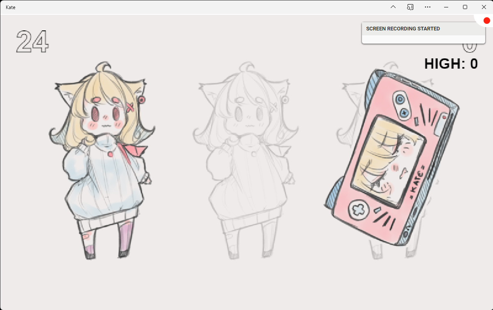

Resource indicators
===================

Sometimes the Kate emulator has to tell you that something is happening
behind-the-scenes in the console, but it shouldn't cause you to stop
what you're doing to pay immediate attention to it. For example, it's
important to let you know when the emulator is recording your screen,
or using the internet, but neither of these are things that need action
from you.

Like :doc:`trust frames <trust>`, we want to show this information in
a way that cartridges cannot tamper with or mimic, since we'll use it
to tell you things that directly impact your security and privacy. It
would be a huge problem if a cartridge starts recording your screen
and manages to remove any feedback of this happening.

The Kate solution for this is the "Resource Indicator Band": an area
that's outside of any cartridge's access which shows small icons for
quick feedback on security/privacy-impacting things that are happening
right now.

Hand-held and TV-modes
----------------------

When running the emulator in Hand-held or TV mode, the resource indicator
band is a small area of icons at the bottom right of the console, right
in the case—to the right of the "KATE" engraving in the console case.

.. image:: img/resource-indicator.png

Cartridges cannot change these indicators because they have no access
to anything outside of the Kate screen.

Fullscreen mode
---------------

When running the emulator in full-screen mode, the resource indicator
band is a small area at the top-right of the screen:

Cartridges cannot change the indicators in this area because Kate's
resource indicator is always on top of the screen—like an overlay.
Cartridges do not have access to this overlay to modify it, and
anything they paint on the screen at that position will simply
be covered by Kate's resource indicator overlay.

Resource icons
--------------

+-----------------------+-----------------------------------------------------+
| Icon                  | What is it used for?                                |
+=======================+=====================================================+
| |icon_tmp_storage|    | **Temporary storage**                               |
|                       |    Used in the web version of Kate to               |
|                       |    indicate when the emulator is operating on a     |
|                       |    `Best-Effort storage mode`_, and so the browser  |
|                       |    may decide to erase the console data if you      |
|                       |    start running out of space.                      |
|                       |                                                     |
|                       |    Adding to favourites or                          |
|                       |    :ref:`installing as a web app <Web Application>` |
|                       |    may solve the issue in Chrome and Safari.        |
|                       |    In Firefox you'll need to grant the              |
|                       |    "Persistent Storage" permission to the page.     |
+-----------------------+-----------------------------------------------------+
| |icon_low_storage|    | **Low storage**                                     |
|                       |    Used to indicate that the device's storage has   |
|                       |    very little free space, which might impact all   |
|                       |    of Kate's functions that store data.             |
|                       |                                                     |
|                       |    :ref:`Archiving`                                 |
|                       |    or :ref:`deleting data`                          |
|                       |    is advised.                                      |
+-----------------------+-----------------------------------------------------+
| |icon_recording|      | **Recording screen**                                |
|                       |    Used to indicate when a cartridge is currently   |
|                       |    recording the screen using the provided Capture  |
|                       |    API.                                             |
+-----------------------+-----------------------------------------------------+

.. |icon_tmp_storage| image:: img/icons/temporary-storage.png
   :width: 32px

.. |icon_low_storage| image:: img/icons/low-storage.png
   :width: 32px

.. |icon_recording| image:: img/icons/recording.png
   :width: 32px

.. _Best-Effort storage mode: https://developer.mozilla.org/en-US/docs/Web/API/Storage_API#bucket_modes