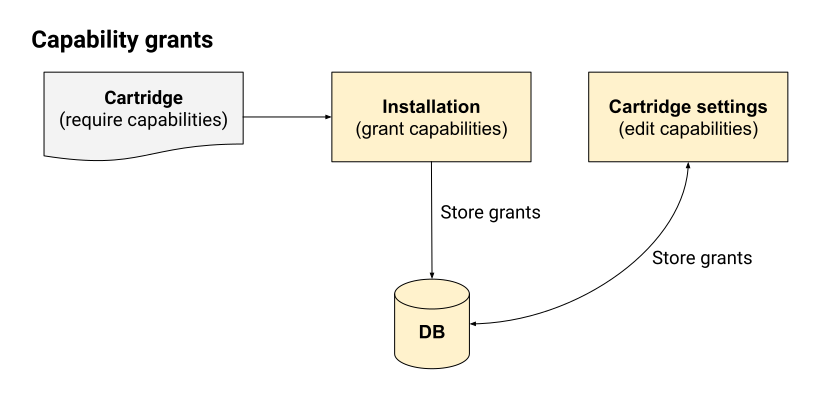

#K0001 — Capabilities
=====================

:Author: Q\.
:Started: 2023-07-24
:Last updated: 2023-07-24
:Status: Design in progress

Timeline
--------

=========== ================ =====================
First draft Proof of Concept Stable implementation
=========== ================ =====================
2023-07-24  —                —
=========== ================ =====================

Summary
-------

In order to provide a safe platform for users and provide more privacy
guarantees for users, Kate uses a capability-secure operating system.
Kate's capabilities are unique names, as used in Snap, Flatpak, mobile OSs,
and the author's previous work on Crochet. However they are not just
boolean flags.

The ability of configurating a capability puts Kate in a position that's
between simple permission toggles (as seen in Snap, Flatpak, or Crochet's
static capabilities), and fully-featured Object-Capabilities (as seen in 
E, Pony, and Crochet's dynamic capabilities).

Like in Crochet, Cartridges must specify its capabilities upfront, and users
decide whether to grant them or not. Capabilities fall into three categories:

* **Required**: The cartridge cannot function without this feature;
* **Optional**: The cartridge provides additional content iff this feature is available;
* **Contextual**: The cartridge will ask for this feature in response to a user's action;

Contextual capabilities must still be requested from the cartridge, but users
will be prompted every time they're used — and they may *disallow future prompts*
at any time.

Together, these capabilities form the basis of Kate's ideas of security,
privacy, and active consent.

Why use capabilities?
---------------------

When it comes to security, there are two major design approaches: ACLs and
Capabilities. They both boil down to different answers to the question of
"Is this application allowed to do X?"

With ACLs, different *users* are assigned different permissions. Applications
then inherit all permissions from whoever user is running them. For example,
if your regular user can delete every file in your personal files folder, and
you run a random application as that user, then the application would likewise
be able to delete every file in your personal files folder.

With Capabilities, different *processes* are assigned different permissions.
This means that each application will get its own set of permissions, regardless
of which user runs them. Users are likewise just processes here, so each user
will have its own independent set of permissions. Any process can delegate
some of its permissions to other processes, but it can't delegate permissions
that it doesn't have.

Let's say that Alice is a user who can delete all files in her personal files
folder, but not files in Bob's personal files folder. The application "Remove"
is an application that can delete any files it's given permissions for. When
Alice runs the "Remove" application, no matter how hard she tries, she won't
be able to get "Remove" to delete any of the files in Bob's personal files
folder because she herself does not have that power to grant the application.

The main difference between Capabilities and ACLs here is that no process
magically inherits any permissions. That is, if Alice runs the "Remove"
application without explicitly giving it powers over any files, then the
"Remove" application won't be able to delete any file — even though Alice
herself can delete her own files.

Capabilities work together with users and applications to form a conversation
where powers can be negotiated. Applications can ask for things the user can
do, and users can decide whether that is a sensible thing to allow or not.
Users are always in control.

Kate's capability design
------------------------

In Kate, capabilities are static keys that a cartridge can ask for. These
keys can take additional configuration to further restrict the powers
granted to the cartridge. For example, a cartridge asking for a
``Network Access`` capability would then need to specify which domains
it needs access to.

From the point of view of a cartridge, the a capability is an unique key,
a possibly set of configurations (which differs by capability), a usage
restriction (e.g.: Contextual, Required, or Optional), and the reason
why the cartridge needs this capability.

This reason is never shown to the user *for risk assessment decision*,
because malicious cartridges could literally write anything there and
mislead users regarding what risks they'd be taking. Rather, it's used
for store reviews and additional clarification for the user *after being
informed of all risks*.

Additionally, capabilities have an associated "risk category". This is
similar to Crochet's idea of risk category, which has different 
capabilities classified in low, medium, high, or critical risk. The riskier
a capability is, the more security review is necessary to get a cartridge
accepted, and the more users are encouraged to make appropriate risk
assessments in their own context. Risk categories allow us to lessen the
burden on users by avoiding the case where we list hundreds of low-risk
capabilities and bury important high-risk ones in the noise.

Unlike Crochet, however, Kate's risk categories are statically defined by
the OS, rather than the cartridges. In the future we might have
cartridge-provided capabilities as well, so this might change, but right
now all capabilities are provided by the OS, thus all risk categories are
defined by the OS.

Some combinations of capabilities also increase their risk category. For
example, "File access" is a medium risk category, and "Network access" is
a high risk one. But when these are combined the overall cartridge risk is
bumped to "critical" rather than taking the maximum of all risks ("high" in
this case). That's because combining "File access" with "Network access" opens
up the door for far more dangerous and potentially harmful data exfiltration
attacks which are not pratical with either of those capabilities separately.

Capability management
---------------------

Unlike ACLs, capabilities require active management. The more fine-grained they
are, the more management is required from users. Capability management is
possibly the most dangerous part of a capability-secure implementation, since
we might burden the user so much with the details of management that we
*prevent* them from doing any actual risk assessment and hence end up with
a system that's less secure and private than an equivalent one using ACLs;
and in the process end up causing a lot more harm to users.

Kate's approach to capability management is derived from the work in Crochet,
but also inspired by capability management in mobile OSs and web browsers.
We want to shif the burden, as much as possible, to cartridge authors and
store administrators, rather than cartridge users. This way we can leave users
in charge of deciding the amount of risk they're comfortable with taking.

To that end Kate makes the following choices:

* **Encourage contextual capabilities**: Most capabilities don't need to be
  granted to the cartridge at all times; we don't need to burden the user with
  upfront risk assessment for things they can't even predict or put in context.

  Assessing the risk of something like "can this cartridge access the internet?"
  when you're installing the cartridge is a very different game from assessing
  the risk of clicking on something in the cartridge and being asked
  "would you like to open https://qteati.me/?"

* **Auto-grant as many capabilities as reasonable**: Many capabilities are
  low-risk enough that, for the vast majority of users, it makes sense to
  just auto-grant them when the cartridge is installed and notify the users
  of high-level risks instead of providing them with an endless screen of
  switches for very fine-grained details.

  Mobile OSs and web browsers have likewise moved in this direction of
  auto-granting low-risk capabilities and giving users a chance of disallowing
  them if their threat model is not the average one — users with a higher
  threat model are more likely to do more detailed risk assessment in any
  case.

* **Rely on risk categories to summarise risks**: It's possible that a
  cartridge asking more than a couple of capabilities ends up drowning
  important, high-risk capabilities in noise. This, in turn, leads to
  the same security alarm fatigue many infosec professionals need to
  deal with.

  By being able to categorise capabilities into risk profiles we can
  surface the ones that are more relevant to the user's threat model
  and help them make a better risk assessment for their own personal
  context.

Risk management is always an active part of using any system, so Kate
acknowledges it doesn't end after installing the cartridge. This means
that users only make an initial risk assessment upon installation
(if the cartridge falls into the "risky" profile), and later has to
manage the risks from both contextual capability dialogs and from the
capability management page for each cartridge.

Users' risk profile
-------------------

The user's risk profile describes to Kate what the user is comfortable with
so that we don't burden them with unecessary security alerts. Kate allows
the user to set this profile based on its own risk categories:

* **Low**: Risks in this category are mostly mitigated, contained, or can
  be handled through *informed* consent. It's very unlikely that they would
  lead to material harm.

  E.g.: "can this cartridge save a file in your device?" has very low risk
  if the cartridge's content is static. The cartridge may be able to save
  unwanted or harmful content on the users' device; but for harmful content
  (such as malware), further actions from the user would be required in
  order to execute it.

* **Medium**: Risks in this category cannot be fully mitigated or contained,
  and it's not possible to provide *informed* consent. Material harm may be
  mitigated through active consent, but it's unclear if that applies to every
  scenario.

  E.g.: "can this cartridge read a file in your device?" has medium risk
  if Kate cannot restrict the files the cartridge can read. It's medium only
  because the user needs to select the files that the cartridge will read,
  so there's informed consent involved, but it's not possible to predict what
  the cartridge will do with the data and files in the users' device can
  contain very sensitive information.

* **High**: Risks in this category cannot be fully mitigated or contained, and
  it's not possible to provide *active* consent. Material harm is likely,
  though in the average case it's unlikely to translate into physical or
  mental harm; more vulnerable individuals may be more at risk.

  E.g.: "can this cartridge access the internet?" has high risk because
  Kate cannot tell the user when the cartridge will access the internet, what
  it will use the internet for, and what information it's going to download
  or upload to external servers. Cartridges with this capability can alter
  their content in ways that cannot be vetted or profile and track users in
  ways that aren't in line with Kate's privacy guarantees.

* **Critical**: Risks in this category cannot be mitigated or contained.
  Consent is not possible. Material harm is likely, and it's possible that
  it translates into physical or mental harm; more vulnerable individuals
  are particularly at risk.

  E.g.: "can this cartridge read files in your device and access the internet?"
  has critical risk because a cartridge can exfiltrate data and mount attacks
  in ways that cannot be predicted in a security review. For example, a photo
  editing application with internet access can first read personal, possibly
  intimate photos from a user and, without their consent, send those photos
  over to an external server under the cartridge author's control.

Capability enforcement
----------------------

Grants
""""""

Capabilities are granted in three distinct moments:

* **Installation**: When a cartridge is installed, the cartridge will be
  granted some initial set of capabilities. Some of these will be auto-granted,
  and some of these will be asked the user, depending on its risk
  classification.

* **Setting changes**: Users can go to the settings screen at any point
  (even while the cartridge is running) and enable or disable any of the
  capabilities that the cartridge is entitled to.
  
  Note that, unlike some object-oriented implementations of capabilities,
  revoking a capability here *does* take effect immediately. This, in turn,
  implies that all capability-bearing actions have to be asynchronous and
  go through the trusted capability supervisor anyway; holding a reference
  to a powerful API is not enough.

* **Contextual grants**: Users may be prompted for grants or revocations of
  contextual capabilities when the application attempts an action. In these
  cases the grant or revocation also takes effect immediately, even if the
  application has already got access to the API object.

The following graph illustrates how capability grants are managed:

Enforcement
"""""""""""

Capabilities are enforced whenever the cartridge is running. In order to use
any capability-bearing API the cartridge must first ask the trusted Kernel for
the API access, then the Kernel API asks the Capability Supervisor if such
access applies to the cartridge. The cartridge is granted the power to use
the API if it has a grant for that capability.

The following graph illustrates this process:

.. image:: ../img/capability-enforcement.svg

It's important to note that there are two distinct parts here: requesting
*access to* the API, and performing *actions in* the API. Both of these go
through the same process of asking the Capability Supervisor, but only
requesting access to the API will trigger a contextual grant dialog.

Here's a less abstract example:

* ``Imagine`` is a cartridge that allows users to paint images, and optionally
  import layers from existing image files. To do so it has the ``Access user files``
  capability as "optional", which means it's not auto-granted when the user
  installs the cartridge.

* The user selects ``Import from file...`` button in the cartridge. The cartridge
  asks for the "UserStorage" API object. The application does not have a
  grant for this capability yet, but it's entitled to have one, so Kate asks
  the user if they would like to grant access to some files.

* The user selects a file to grant the application access to and confirm the
  grant. Only after all this time the request promise is resolved with the
  "UserStorage" object. The cartridge keeps this in memory.

* The cartridge then uses one of the methods in the "UserStorage" object to
  read the file the user has granted access to and imports the image to its
  canvas.

* The resource indicators section is updated to indicate that a cartridge has
  recently accessed the user's files. The audit log is likewise updated.

* Some time later, the user goes into the Settings screen for the cartridge
  and removes all file access capabilities from it.

* Upon returning to the cartridge screen, the ``Imagine`` cartridge uses its
  "UserStorage" instance, which it kept in memory, to try reading the file
  the user has previously granted again. This time, because the user has
  removed the capabilities, the request fails immediately with a permission
  error. No dialog is shown to the user, because the cartridge is not
  requesting permission to the API, only trying to use its old object instance.

* The audit log is updated with the failed request.

How is this feature dangerous?
------------------------------

Capabilities are a known model for managing permissions in a way that allows
users to better understand and control what applications can do on their
behalf, but it's not without risks. Here we look at risks from the users'
perspectives, the Kernel's perspective, and cartridges' perspectives.

**Increased security management burden:**
  Because capabilities can be very fine grained and allow users to control
  a lot of details of their safety and privacy while using Kate, there's a
  risk that the average user will find the effort of managing their security
  too high and hence put themselves in an unsafe position by granting more
  capabilities than they should.

  Kate addresses this with a couple of different approaches:

  * **Risk profiles**: users can decide a high-level baseline of risk they're
    okay with accepting by default; Kate will not force them to manage these
    risks, allowing them to focus on the things they *do* care about instead.

  * **Encouraging contextual grants**: cartridges should have as many contextual
    grants as possible, this removes the upfront and continuous burden of
    managing capabilities and instead puts them where the user can make some
    cause/effect connection.

**Fine grained capability noises:**
  Because capabilities in Kate are finer grained than in most mobile OSs,
  cartridges might end up asking for a large amount of capabilities and
  important risk assessment might become difficult as users are unable to
  know what to focus on.

  Kate mitigates this by giving capabilities a risk category, then using these
  risk categories to highlight more critical risks and summarise less critical
  ones.

**Unclear cause/effect attacks:**
  Because capabilities can be granted but not used immediately, there's a risk
  that a cartridge might be given a capability at point A, and only using it
  maliciously at a much later point B, where the user might have forgotten that
  the capability was granted at all.

  Kate mitigates this in two distinct ways:

  * **Resource indicators**: when a cartridge uses a dangerous capability,
    e.g.: file access or network access, Kate will notify the user that this
    is happening through a secure icon on the screen.
  
  * **Audit logging**: when cartridges use dangerous capabilities this use is
    logged to the audit log. Users can then use the audit log to infer possible
    effects and causes of those effects after-the-fact, and take the appropriate
    measures to mitigate harm on their side.

  In the future we'd like to look into making critical capabilities short-lived
  by default as well. This means that a user would not be able to grant a
  critical capability on day 1 to a cartridge, and then access this cartridge
  a month later and fall victim to an attack using that capability. How exactly
  these capabilities will "expire" should be the subject of a separate
  investigation.

**Misleading reasons for capabilities:**
  Because Kate allows cartridges to provide a reason for asking for a
  capability, it's possible that authors of malicious cartridges write
  misleading reasons that will misrepresent the risks to users and lead
  them to make bad risk assessments.

  For example, if a cartridge asks for "full network access" and give as
  the reason "we'll use this to show you cat pictures" that does not mean
  that there are no risks to the user. Full network access still implies
  that the cartridge would be able to exfiltrate user data, track users
  in ways that don't align with Kate's privacy, or download malware in
  ways that cannot be vetted in a security review.

  Kate mitigates this by not showing the reason to users during any form
  of risk assessment, but still allowing users to view these reasons as
  a statement of the cartridge's intent (which should not be taken as more
  than that), should they choose to trust the cartridge *after* the risk
  assessment.

**Unreliable grants:**
  Because capabilities are checked at the point of usage and not only at
  the point of request, it's possible that a cartridge is granted access to
  a powerful API object, but when they try to use it the grant is already
  revoked.

  Kate favours the user's agency here and expects cartridges to handle
  permission errors on all API operations, not only on API object requests.

**Storage overloading:**
  Because capability uses are logged to the audit storage, there's a risk that
  misbehaving cartridges (either intentionally or accidentally) end up flooding
  the system with capability requests that are denied, and hence filling up the
  audit storage in unfair ways.

  Kate mitigates this by letting the audit supervisor decide how much to log
  and to ask particularly misbehaving cartridges to be terminated.

References and additional material
----------------------------------

* `Robust composition: towards a unified approach to access control and concurrency control <http://www.erights.org/talks/thesis/>`_
  — academic thesis on capability security by Mark S. Miller;

* `Capability Security does not exist in a vacuum <https://robotlolita.me/diary/2020/10/capability-security-ux/>`_
  — blog post on capability security UX;

* `Snap's security policy and sandboxing <https://snapcraft.io/docs/security-sandboxing>`_
  — documentation on Snap's capability usage;

* `Capability myths demolished <https://papers.agoric.com/papers/capability-myths-demolished/abstract/>`_
  — academic paper comparing capability security and ACLs, by Mark S. Miller, Ka-Ping Yee, and Jonathan Shapiro;

* `Crochet's security and capabilities <https://crochet.qteati.me/docs/reference/system/security/index.html>`_
  — documentation on Crochet's static and dynamic approaches to capability security;

* `Isolating application sub-components with membranes <https://tvcutsem.github.io/membranes>`_
  — Tom Van Cutsem's blog post on membranes and its use in the web;