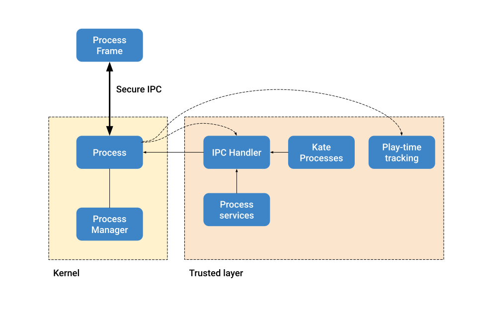

#K0004 — Processes
==================

:Author: Q\.
:Started: 2023-12-08
:Last updated: 2023-12-08
:Status: Design in progress

Timeline
--------

=========== ================ =====================
First draft Proof of Concept Stable implementation
=========== ================ =====================
2023-12-08  —                —
=========== ================ =====================

Summary
-------

Kate allows a user to install multiple applications in a single shared system,
and then launch those applications to operate on the system resources. It's
important that we make sure these applications are properly isolated, and
that they can access the resources they need and have access to securely.

To that end Kate manages each of these launched applications as a "Process",
and provides a secure channel for the process to communicate with the
kernel, resources, and with other applications.

Design-wise, processes in Kate are not too unlike those in other operating
systems, except for the fact that Kate is hosted, so the host operating
system (or Browser) manages the memory and time-sharing, while Kate only
manages output and resource access. This makes the kernel significantly
simpler.

Technical summary
-----------------

Kate has two distinct process objects, since it's a layered operating system.
At the kernel layer you have ``Process`` (and ``ProcessManager``), which provide
the basic operating capabilities of what it means to be a process.

Processes in the kernel layer only have basic output capabilities, but no
access to shared resources. This is because the kernel layer is similar to
a microkernel, and it does not do a lot.

At this layer, the main job of ``Process`` and ``ProcessManager`` is to create
a fully isolated area for the application code to run, and to provide a
secure channel that this particular application code can use to communicate
with the kernel, in a fully authenticated fashion.

For the Browser-based implementation, isolation is provided by a sandboxed
iframe with no powerful capabilities. Authenticated messaging is provided
by exchanging `MessagePorts <https://developer.mozilla.org/en-US/docs/Web/API/MessageChannel>`_
in a straightforward handshake.

The ``ProcessManager`` keeps track of which processes are running at any given
time and provides resolution to process objects by their unique identifier,
but it doesn't do more than that.

At the trusted-space layer, we have ``KateProcesses``. This service handles
spawning processes in the kernel layer and starting up the process
(adding it to the screen, setting up the IPC handlers, starting up the
play time tracking, providing a way of reading files, etc).

Because processes run isolated, they must send a message to the kernel
every time they wish to do something outside of basic output capabilities.
This goes also for things like reading files that the application owns.
Messages must provide a unique identifier, which the trusted-layer side
uses to reply to. Any further coordination and evaluation of the message
happens in the trusted-space layer.

This gives rise to the following topology:

Spawning phase
""""""""""""""

Processes start their lifecycle by being spawned — the kernel will allocate
an isolated frame for them to run, and then load the application's startup
code in this frame.

Application code is linked to the Kate API (and potentially any bridges)
before being loaded in the frame. And it is up to the Kate API to set up
the application side of the IPC.

This is also the point where we decide which files the process will have
access to, by providing a layered file system to the process. Currently
this file system consists only of the files in the cartridge.

Pairing phase
"""""""""""""

Once the frame exists, it's loaded in the page and the pairing process
starts. This is a straightforward handshake:

- The kernel tells the application it's ready to pair;
- The application sends a pairing request to the kernel using its shared 
  secret, and provides a messaging channel for the kernel to reply;
- The kernel validates the source and the secret. Then it creates a new
  secure channel between itself and the application and sends it over
  the channel the application shared previously.

Once the pairing process is concluded, communication happens exclusively
through the message channel the kernel has created.

Service initialisation
""""""""""""""""""""""

Once the kernel and the process are properly paired, we can start up and
link the process to the additional trusted-space services. This is where
we spin up the rendering process, the input-forwarding process, and the
IPC-handling process.

The IPC-handling process itself takes care of forwarding messages sent
by the application process to the relevant services and APIs, and then
takes care of replying to the application process with the result of
that operation. Further authorisation happens on the services/APIs
themselves.

Process lifetime
""""""""""""""""

During the process lifetime, it sends heartbeats and metrics to the
kernel in addition to the regular messages it sends for requesting
API permissions. This is necessary because the kernel is also not
allowed to read the state of the application processes directly;
it then treats it in a similar fashion to a remote node in a
distributed system.

Eventually processes go through changes of state (e.g.: pausing/unpausing),
and die. The kernel uses explicit transition messages to keep track of
what's happening with the process, and may use heuristics based on heartbeats
and metrics when processes go rogue or become uncommunicable to take further
actions to ensure system stability and responsiveness.

Formal semantics
----------------

Processes can be thought of as objects that communicate between each other
and have access to different sorts of resources. This gives rise to the
following model:

.. code-block:: haskell

  type Meta = {id, capabilities, files, runtime}
  type Manager = {[id -> Process...]}

  type Process =
    | Spawned(meta, frame, secret, public-channel)
    | Pairing(meta, frame, secret, public-channel)
    | Paired(meta, frame, exclusive-channel)
    | Dead

  type Frame =
    | Spawned(secret, public-channel)
    | Pairing(frame-channel)
    | Paired(exclusive-channel)

  Manager m ::
    | spawn(Meta) -> Spawned
    | pair(Spawned) -> Paired
    | kill(Process) -> void

If we look at things from the perspective of the process manager. We may
spawn a process, which then allows us to pair the process, and eventually
we might choose to kill the process. Note that communication moves to
different channels over the course of this process.

Manager semantics
"""""""""""""""""

``m.spawn(Meta)``
'''''''''''''''''

  m { [i1 -> p1, ..., iN -> pN] }.spawn({iA, files, runtime, ...}) =
    let Secret = unique-secret();
    let Code = runtime-code(files, runtime, Secret);
    let Frame = sandboxed-frame(Code);
    m {[i1 -> p1, ..., iN -> pN, iA -> Spawned({iA, ...}, Frame, public-channel)]}

That is, we can spawn a process from any runtime configuration given that
the id it's been assigned does not conflict with one we're running already.
This restriction is Kate-specific, and only here because we do not offer
tools to concurrently operate on a Process' backing storage and resources,
so we can only run one copy of the application at any given time.

We then set up the runtime code that will be run in the sandboxed frame.
This includes a uniquely generated secret, whose only purpose is to
make it more likely that it is the Kate API that is establishing the
connection; note that in case the pairing is hijacked and other application
code establishes the connection that has no bearing on the security guarantees
we provide, as we treat all code in the frame with the same untrusted level.
But this prevents accidental pairings that would cause the API to not work
in the process, as it doesn't have a channel to the kernel.

Finally we produce a spawned frame using the public channel, which is shared
by all processes in the system.

``m.pair(Spawned)``
'''''''''''''''''''

.. code-block:: haskell

  m {[i -> p, ...]}.pair(Spawned) =
    on process.Spawned(meta, frame, secret, public-channel):
      public-channel <- PAIRING_READY;
      state is Pairing(meta, frame, secret, public-channel);

    on frame.Spawned(secret, public-channel):
      wait public-channel : process sent PAIRING_READY:
        let {KernelPort, FramePort} = message-channel();
        public-channel <- PAIR {KernelPort};
        state is Pairing(FramePort);

    on process.Pairing(meta, frame, secret, public-channel):
      wait public-channel : frame sent PAIR {frame-channel, secret}:
        let {KernelPort, FramePort} = message-channel();
        frame-channel <- PAIR {FramePort};
        state is Paired(meta, frame, KernelPort);

    on frame.Pairing(frame-port):
      wait frame-channel : process sent PAIR {exclusive-channel}:
        state is Paired(exclusive-channel);

That is, the we start with a public channel, which is usable by all processes
in the system, and send the frame a `pairing-ready` message. The frame then
creates a new channel and asks the kernel to pair. The process creates
a new exclusive and authenticated channel between the two parties and
sends the channel over to the frame. At this point both the process and
the frame are considered paired, and communication can proceed in the
exclusive channel.

``m.kill(Process)``
'''''''''''''''''''

  m {[i -> p, ...]}.kill(p) =
    unload-application(p1);
    m {[...]}

Killing a process is a one-sided, ungracefull operation. The kernel
unloads the application code from memory and removes it from the
process table.

How is this feature dangerous?
------------------------------

Almost every other security guarantee in Kate depends on processes being
correctly isolated. Here we consider risks from users', cartridges', and
Kate's perspectives.

