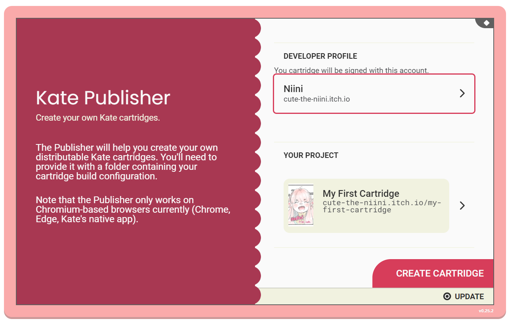
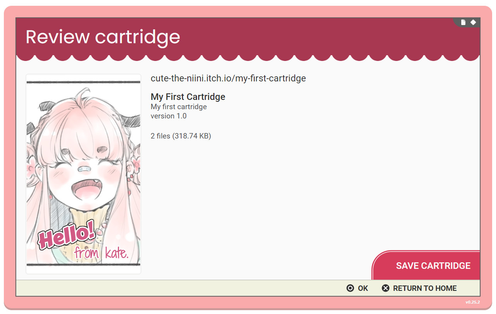
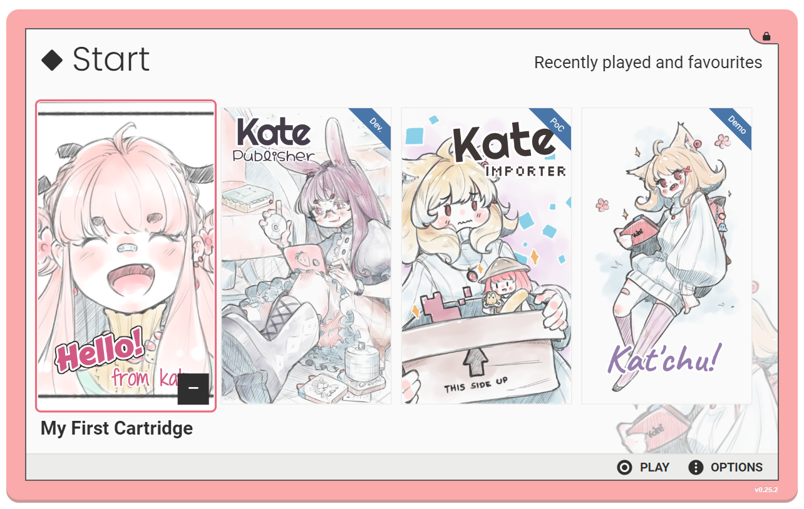
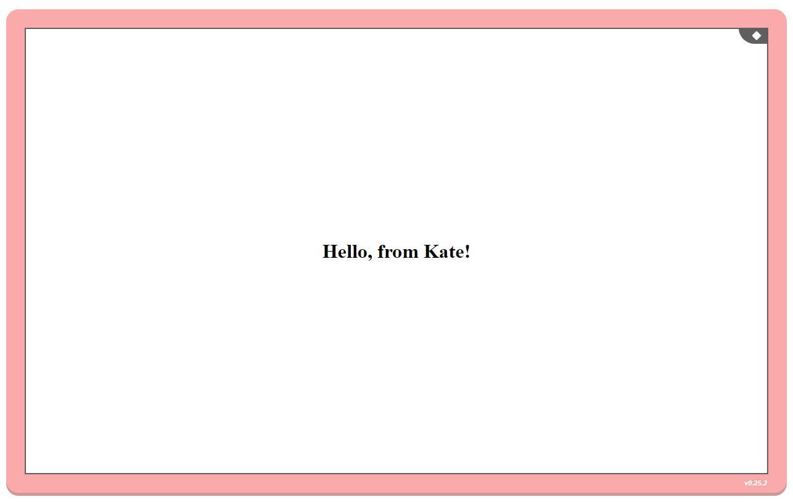

Hello, World
============

Creating a start page
---------------------

.. note::

  To make games for Kate, it's recommended that you first take some
  time to learn the `basics of web development <https://developer.mozilla.org/en-US/docs/Learn>`_.
  This section will assume you know what web pages are, and how to
  make one using the basic features of HTML, CSS, and JavaScript.
  
  While you can publish Kate cartridges without knowledge of web development,
  it'll greatly aid debugging any issues that may arise.

Let's start by trying to get something to show up on the screen, to make
sure everything is set up correctly and your Kate emulator can play games.

To begin with we'll create a HTML page. Kate cartridges distributed with
the web runtime all start with one HTML page.

Create a file called :download:`index.html <example/index.html>` in your text editor with the following
contents:

.. literalinclude:: example/index.html
  :linenos:

Here we have a page with the text "Hello, from Kate!", and some :term:`CSS`
to put it in the centre of the screen. If you open ``index.html`` on a
web-browser you should see something similar to the image below:

.. _kart cartridge configuration:

Cartridge metadata
------------------

Not very exciting, but hey, baby steps!

Now, we want to turn this into a Kate cartridge, which we can then install
in a Kate emulator to play. To do so we'll need to create a file describing
the cartridge, that's then used by the Publisher tool to build the actual
cartridge.

Create a file called :download:`kate.json <example/kate.json>` in the same
folder as your ``index.html``, and give it the following contents:

.. literalinclude:: example/kate.json
  :linenos:

This file tells the Publisher tool that there's a game identified by
``my.domain/my-first-cartridge``. The ``my.domain`` part should match
what your developer profile uses, otherwise you won't be able to sign
the cartridge. The ``my-first-cartridge`` part can be anything (using
only letters and hyphens), but it must be unique among your games.

A version is also required, and every time you publish a new cartridge
release, you should update the version number. Here we start with
version "1.0".

We also provide a more readable title, ``My First Cartridge``. This is
what players will see in the cartridge selection screen. And we tell
Kate which file will serve as the thumbnail image for the cartridge—the
thumbnail is optional, but highly recommended, and should be 400x700 pixels.
For this you can use the :download:`thumbnail.png <example/thumbnail.png>` image below:

Next we tell Kate what files are actually in the cartridge. Our cartridge
so far is made up of a two file, ``index.html`` and our ``thumbnail.png``.
All files we declare in this ``files`` section will have their contents
included directly in the cartridge file (using a special :term:`file system`).

Finally, in order to play this cartridge, we tell Kate to use the
``web-archive`` platform. This means that 
Kate will treat it as if it was a web page of sorts. This ``web-archive``
platform requires us to specify which web page Kate should load first;
we only have one, so ``index.html`` is is.

.. _package your game:

Packaging your game
-------------------

Having your files in place, it's time to open the Publisher application
and select both your developer profile and the project folder. You should
see something like the following:

.. note::

  If you get a warning saying "Developer domain doesn't match the work's domain",
  it means your ``kate.json`` configuration has a cartridge ``id`` that is
  different from your developer profile's domain. You need to update it so
  it matches.

When you click ``Create cartridge``, the Publisher will generate a cartridge
for you and use your developer's key to sign it. You might need to use your
password to unlock your signing key if you haven't unlocked it recently.

Once the cartridge is ready to be saved, you'll see a review screen that
includes a summary of the cartridge. Clicking the ``Save cartridge`` button
will let you save the ``.kart`` file to your device to distribute it:

Testing your game
-----------------

With a ``.kart`` file in hand, you should try out your cartridge. First
close the Publisher application (press |btn_berry|, then ``Close game``), then
install the new cartridge file you just saved. Your home screen should
show your cartridge, with the title and thumbnail you chose:

When you open the cartridge, you should see the same screen we look at
in the beginning of this page:

Special game engine support
---------------------------

Kate aims to support a majority of game engines that can export your project
as a web game, and allow players to run those games in a web browser without
the size and lag limitations typical of a browser-based game. The process described here
is very similar to what you'd follow to get a Kate cartridge for a Ren'Py
visual novel, a Godot RPG, or a Bitsy adventure, except you don't need to
write your own HTML page and CSS files.

There's special support built in the Publisher application for many of these
engines, meaning you might be able to get your game to work even with very
little knowledge of web development. Check out the
:doc:`Kate Porting Recipes </dev/port/index>` book for configuration examples
and tips on how to create cartridges for games made in Ren'Py, Godot, Bitsy, and more.