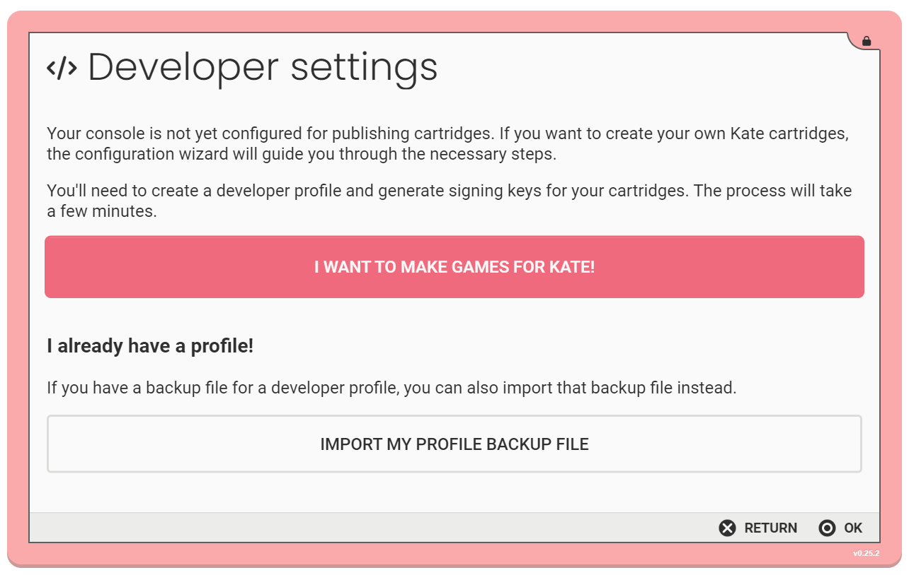
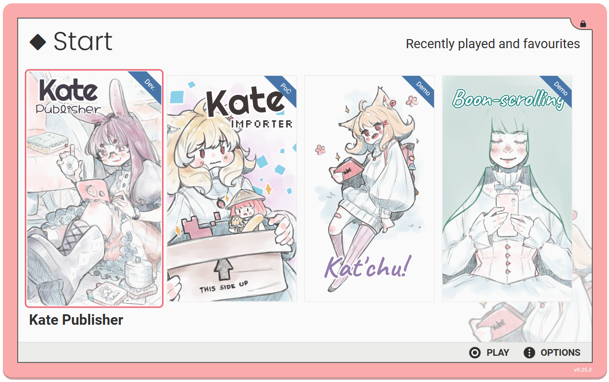

What will you need?
===================

Installing the emulator
-----------------------

To run games in Kate you'll need an emulator. The recommended way of testing
the games is to use the web-based emulator. The Kate developers maintain a
public instance of Kate on the internet, which you can open in a modern
browser by accessing https://kate.qteati.me. You should install this as a
web application as otherwise the browser might decide to randomly delete all
data you stored in Kate (it's only stored locally in your device).

The :doc:`intallation instructions section </user/manual/intro/install>` goes
into more details about what browsers are supported, specific instructions
for platforms like Steam Deck, and alternative installation options, including
running your own Kate web emulator instance.

Creating a developer account
----------------------------

Kate requires all cartridges to be digitally signed by its developers. A
digital signature proves to players that the one who published the cartridge
was really you.

This additional step is needed since Kate does not require
cartridges to be distributed through a single store—you can distribute your
cartridge wherever you like, however you like. Thus players need some additional
guarantees to know that the cartridge they're trusting is indeed made
by the person they're trusting.

The console will help you set up all the necessary things to digitally sign
your cartridges. By accessing ``Settings -> For developers`` you'll be
presented with a "developer onboarding" setup that looks like this:

Here you choose "I want to make games for Kate" and complete the steps for
setting up a new developer account (which is only stored locally on your
device). During these steps you will:

* Choose a name for your developer profile, and a domain
  (e.g.: ``cute-the-niini.itch.io``) which you have control over and
  uniquely identifies you to your players;

* Secure your key store with a password. This key store holds all of the
  necessary data to sign cartridges digitally with the developer information
  you chose, and it's kept safe (encrypted) with the password you provide.
  This is the only password you'll have to remember for all Kate usage.

* Generate a private key that will be used to sign your cartridges, and an
  equivalent public key which Kate will use to verify your cartridge
  signature whenever someone installs it.

* Publish your public key so it's accessible to other Kate devices and proves
  that you're truly the person who controls the domain provided for your
  developer profile. For example, if you're using your itch.io domain, you'd
  copy the text in this step and paste it somewhere in your profile's page.

* And, finally, save your profile so it can be used by the Kate development
  tools.
  
.. important::

  It's strongly recommended that you export your profile and
  store it safely along with your other backups—this way, if you change
  devices or lose access to your data, you can always import it back in
  and use the same profile again. Otherwise you'll need to generate a new
  profile, with a new pair of keys.

  You can export your profile by going to ``Settings -> For developers ->
  Developer profiles -> <Your profile>``, pressing |btn_menu_text| for
  actions, and choosing ``Export profile backup``. Kate will ask you for
  a new password to protect your backup, so you can safely store it anywhere
  without giving other people access to your private key.

.. _installing the kate publisher:

Installing the Publisher
------------------------

The recommended way of creating Kate cartridges is to use the
Kate Publisher application, which you can download either from the
`Github releases page <https://github.com/qteatime/kate/releases>`_ or the
`Itch.io stable mirror <https://cute-the-niini.itch.io/kate-publisher>`_.

To install it, you can drag-and-drop the ``kate-publisher.kart`` file to
your Kate emulator, or use |btn_berry_text| to bring the context menu and
select ``Install cartridge...``.

After installing, you should see the Publisher in your home screen:

(Advanced) Installing the command-line tools
--------------------------------------------

Instead of using the Publisher application, you can use command-line tools
to create Kate cartridges. You might use these tools when setting up
automations for your cartridge publishing.

The command-line tools for Kate require `Node.js <https://nodejs.org/en>`_
to be installed, so you'll need a device capable of installing it. Node.js
supports Windows, MacOS, and Linux.

You'll also need to be familiar with the :term:`command line`.
Once you have Node.js installed, you can install all command-line tools for
Kate using:

.. code-block:: shell
   
   $ npm install -g @qteatime/kate-tools

.. important::
   
   The ``$`` just indicates that you should run these commands as your
   regular user, not with the administrator account. You should not type
   the ``$`` when running these commands.

   With the exception of the native Kate OS for Raspberry Pi, no part of
   Kate (and its tools) requires administrator privileges, and
   they never will.

After running this command you should have three new applications available
in the command line:

* **kart** is used for packaging your games into a single ``.kart`` file,
  which you can distribute for your players to install.

* **kate-dist** is used for bundling a ``.kart`` file and the Kate emulator
  into a web page, which you can then upload to a platform like Itch.io
  as a web game. You'll need to zip the contents of the generated folder
  yourself.

* **kart-show** is used for verifying that a cartridge contains the expected
  configuration and is not corrupted.