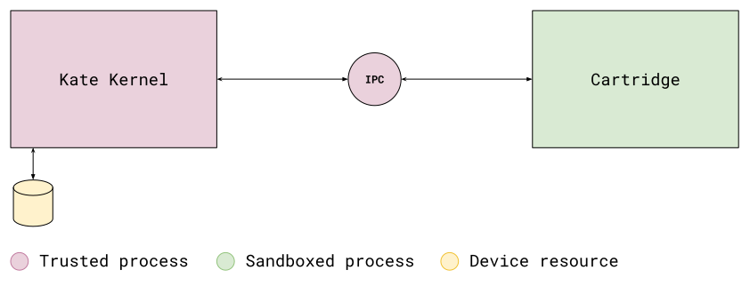

Overview
========

Kate is a security-oriented platform. In order to protect users safety and
privacy, it makes heavy use of :term:`capabilities` and :term:`sandboxing`,
as well as isolating components to prevent a faulty component from compromising
the entire system.

On top of that, Kate runs on top of a web browser. This means that
Kate runs in any platform that has a web browser, often with similar
behaviour, but it also means Kate does not have access to any of the
device's native functionality directly. Likewise, nor does your cartridge.

This design helps protect both developers and players, but it also has
implications to how you write games for Kate, and how they run on the
device or emulator.


Principle of Least Authority
----------------------------

Like mobile operating systems, Kate runs your cartridge
(and other Kate processes) with the least amount of privilege possible.
But Kate is far more restrictive than popular OSs on phones. Your cartridge
cannot:

* Access dangerous APIs such as camera, microphone, geolocation, etc;
* Make any network requests, or require internet connection in any way;
* Navigate to or link to a different web page;
* Have direct access to any peripheral device;
* Access the device's or Kate's data in any way (with the sole exception of
  data bundled in your cartridge);

A game that requires any of these features cannot run on Kate. This, of course,
excludes all games made for the web, or that are exported using an engine's
web export option.

To address this harsh restriction and have games playable safely Kate
introduces ways for cartridges to, in a very controlled environment, gain
access to additional features. These are :term:`capabilities`.


Capabilities
------------

In access-list-based operating systems, like Linux, MacOS, and Windows, what
an application can do depends on which user is running the application. Thus,
applications can do anything the user can do—that includes deleting or
modifying any file in the device. Security is achieved by creating restricted
users and running applications with these restricted users; however, managing
multiple users is often cumbersome, so hardly any end-user does it.

In capability-based operating systems, like Android or iOS, what an application
can do depends on what the OS considers "universally accessible", and any
additional features the user grants that specific application. An application
that has not been granted the "read photos" feature cannot read the photos in
the device, even though the user can. Likewise, not granting "use camera" means
you don't have to worry about an application using the camera in a way you
don't want it to.

Kate is a capability-based system, but it has less universally accessible
features than phone operating systems. This is because we encourage players
to download and run any cartridge they find on the internet, without having
to do any risk assessment before running it. So, by default, cartridges can:

* Display things on the screen;
* Play audio (from local data);
* Play videos (from local data);
* Read data bundled with the cartridge, but not modify anything;
* Read Kate gamepad or pointer input (this is not the device's gamepad/pointer!);
* Store up to 64 MB in an isolated storage partition for that specific cartridge;

Anything other than this requires the cartridge to ask the player for
permission first. That includes storing more data in the storage partition,
or downloading/sending data over the internet. And even things like
opening another page when the player clicks a link.


Bridges
-------

Due to these heavy restrictions, no web game can run in Kate as a cartridge
as-is. Even simple hypertext fiction, that would work as a local HTML page,
would fail to run in Kate because having a link open a different HTML page
is not allowed (to avoid phishing attacks). Likewise, having an image in
an HTML page that points to a specific file isn't possible because there
are no URLs or files involved when running a cartridge.

To lessen the burden of porting games not meant to run in Kate to the
platform, Kate provides "bridges". These are small snippets of code injected
in the cartridge process which translate common web APIs and features into a
Kate-compatible form.

For example, the :doc:`network proxy </dev/manual/web/bridges/network-proxy>` bridge allows one to use a regular
```` tag in a web page, and have that translated to load
the file from the cartridge's binary data instead. Audio, fetch, and friends
receive a similar treatment from this bridge.

The :doc:`local storage proxy </dev/manual/web/bridges/local-storage-proxy>`
and :doc:`indexedDB proxy </dev/manual/web/bridges/indexeddb-proxy>` allows one to use
regular web storage APIs while translating all of those calls into operations
on the small 64 MB storage partition the cartridge has access to.

Bridges are likely the place where things can go awry. If things work when
you run it in a web browser, but not as a Kate cartridge, it might be that
you're missing a bridge, or the bridge doesn't offer support for the specific
usage that your web game expects.

For example, some engines load additional JavaScript code by creating a
synchronous ``<script>`` tag and expecting that, after that tag is added
to the document, execution will only proceed when the browser finishes
parsing and executing the code. This can't work in Kate because we first
need to read the code from the cartridge, and there's no way of doing that
synchronously.


Process topology
----------------

Kate runs trusted and sandboxed processes. The only trusted
process is the Kate Kernel, which controls the untrusted processes,
accesses and manipulates device resources, and runs with wider permissions.
Sandboxed processes, such as the process running cartridges, run with
no permissions and need to ask the kernel to access or manipulate a
device resource on their behalf.

Because Kate runs on top of a web browser, processes are mapped to frames,
and use the :ref:`full sandboxing capabilities of the browser <process sandboxing>`, as well
as the appropriate :term:`content security policy`. Browsers on the other
hand generally map frames to distinct processes at the OS level, but this
varies depending on the browser's own sandboxing strategy.

In summary, the topology looks like this:


         the device's storage. The cartridge process (a sandboxed process)
         must use the IPC channel between itself and ther Kernel to ask
         for any operation that is not drawing on the screen.

The only operations that happen in the cartridge process are displaying
things on the screen (using the cartridge's own isolated screen buffer, which
is later layered on Kate's real screen), and playing audio through the
current device's audio output. Everything else goes through the IPC channel.

For example, let's say a cartridge wants to read ``sprite.png``, which they
have bundled in the cartridge binary. To do so it first needs to send a
message to the Kernel process asking to read that file. The Kernel resolves
the file-reading capability of the requesting process to figure out where
to look for the file, then replies with the binary data and file metadata
if the file is found. This operation is always asynchronous.

Messages can be initiated from both sides. The Kate Kernel also sends the
cartridge events through this same IPC channel. For example, when the player
presses a button, Kate sends the active process an event about it. This allows
the cartridge to query the gamepad state synchronously.

The Kernel keeps all the capability metadata on its side. Since these
capabilities never leave the device's memory, and cartridge processes
have no access to writing to it, the capabilities are unforgeable without
any need for cryptographic verification.


In short
--------

Cartridges run in a very restricted environment with no internet access, even
though Kate itself runs on a web browser. This means that your game needs to be
able to run entirely with the data included in your cartridge for it to run
on Kate. You also need to ensure your game does not depend on being loaded
from a particular URL on the internet—since internet URLs don't exist in Kate.
