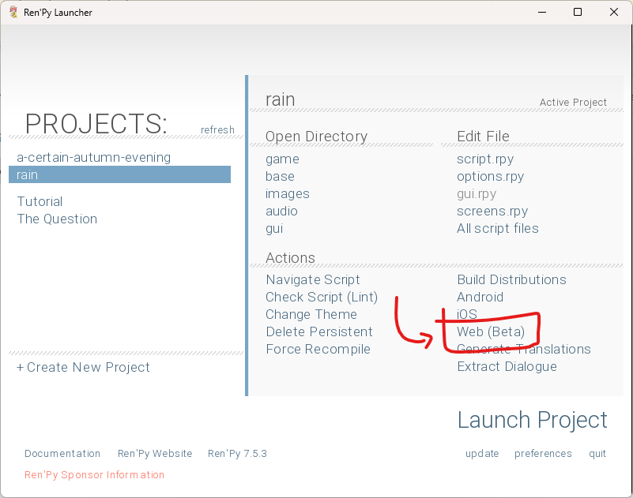
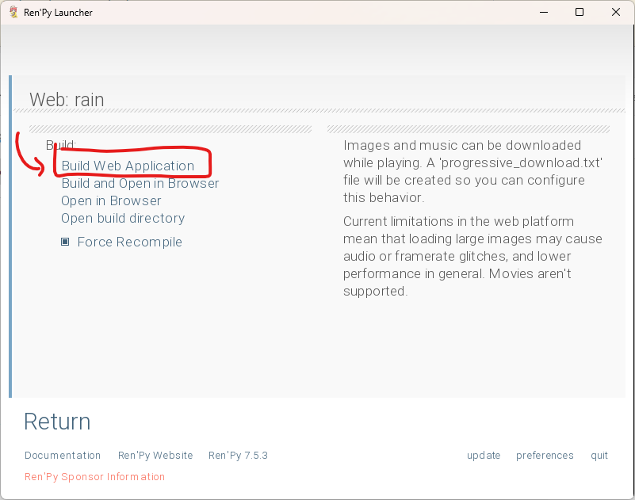

Ren'Py
======

Games made with `Ren'Py <https://www.renpy.org/>`_ can run on Kate with
little configuration, granted they work with the Ren'Py web export.
Text input is not yet supported.

The game
`A certain autumn evening <https://github.com/qteatime/kate/tree/main/examples/a-certain-autumn-evening>`_
included in the ``examples/`` folder in Kate can be taken as a sample of
what a Ren'Py game published for Kate can look like, and the necessary
configuration.

Preparation
-----------

You'll first need to generate a web build of your game, which you can do
from the Ren'Py launcher by using the ``Web (Beta)`` option in ``Actions``,
then clicking ``Build Web Application``.

You can use the ``Open build directory`` option in this same screen to navigate
to the folder where your game's web build was stored. From there you should
have a :ref:`Kart cartridge configuration` and run the ``kart`` application
to :ref:`package your game`. You can find an example configuration using the
Ren'Py recipe below, which should work with most Ren'Py games.

Tips
''''

**Improve startup performance**
  Ren'Py web builds are optimised for streaming the game, but Kate cartridges
  already have the data fully locally. See the `Startup performance`_ section
  on how to take advantage of that for making the game load faster.

**Pre-loading screen**
  Just like regular web builds, Kate cartridges will use the
  ``web-presplash.png`` file at the root of your web build folder to show
  the initial loading screen background; you can change that for something
  that matches your game better.

Kart configuration
------------------

Your ``kate.json`` configuration will generally live outside of the
``*-web`` directory generated by Ren'Py in your game's distributions,
so you need to use the ``root`` option to change the directory Kart
uses for the game assets. The minimal configuration for a Ren'Py game
looks like this:

.. code-block:: json

  {
    "id": "my-namespace/my-game",
    "version": {"major": 1, "minor": 0},
    "root": "my-game-1.0-web",
    "metadata": {
      "presentation": {
        "author": "Me",
        "title": "My Game",
        "tagline": "A Ren'Py visual novel"
      }
    },
    "platform": {
      "type": "web-archive",
      "html": "index.html",
      "recipe": {
        "type": "renpy",
        "save_data": "versioned",
        "pointer_support": true,
        "renpy_version": "7.5",
        "hide_cursor": false
      }
    }
  }

The options for this recipe define how Kate should patch the cartridge
process to provide support for Ren'Py expected features, though the only
option that's required is the Ren'Py version.

renpy_version
  The version of Ren'Py that was used to export the game, in the format
  ``"<major>.<minor>"`` (e.g.: ``"7.5"``). Kate currently is tested on
  and supports Ren'Py ``"7.5"`` and ``"8.1"``.

save_data *(optional)*
  ``"versioned"`` or ``"unversioned"``. This defines whether Kate will use the
  versioned partition or the shared partition for storing save data with
  :py:mod:`KateAPI.store`. Unless you have a good reason to disable versioning,
  the ``"versioned"`` option should be selected. This is the default.

pointer_support *(optional)*
  Either ``true`` or ``false``. The default is ``true``. This controls whether
  users will be able to interact with the game using a pointing device, such
  as a mouse, trackpad, or a stylus (or touch!).

hide_cursor *(optional)*
  Either ``true`` or ``false``. The default is ``false``. This controls whether
  the player's operating system's cursor is shown when moving their
  mouse/pointing device over the cartridge's screen. You only want to disable 
  this if your game uses custom cursors!

Bridges used
------------

This recipe will include the following bridges:

.. code-block:: json

  {
    "bridges": [
      {"type": "network-proxy"},
      {"type": "keyboard-input-proxy-v2", "mapping": "defaults", "selector": "window"},
      {"type": "pointer-input-proxy", "selector": "#canvas", "hide_cursor": false},
      {"type": "preserve-webgl-render"},
      {"type": "capture-canvas", "selector": "#canvas"},
      {"type": "indexeddb-proxy", "versioned": false},
      {"type": "renpy-web-tweaks", "version": {"major": 7, "minor": 5}}
    ]
  }

This configuration should work for most Ren'Py games using the default
web export and the default Ren'Py keybindings. If you've modified the
controls for your game, or modified the HTML that Ren'Py web generates,
then you might need to tweak these manually. You can do that by
specifying the bridges in the ``platform`` section as usual and they'll
take precedence over the configuration above.

Included files
--------------

The recipe will include all files supported by Ren'Py by default, as well
as files generated by the Ren'Py web export. This means:

* Audio (``.wav``, ``.ogg``, ``.oga``, ``.mp2``, ``.mp3``, ``.m4a``, ``.opus``, ``.flac``, ``.weba``);
* Video (``.webm``, ``.ogv``, ``.mp4``, ``.mpeg``, ``.mkv``, ``.avi``);
* Image (``.webp``, ``.png``, ``.jpg``, ``.jpeg``, ``.bmp``, ``.gif``, ``.avif``, ``.svg``);
* Font (``.ttf``, ``.tga``, ``.dds``);
* Ren'Py-specific packaging (``.data``, ``.zip``, ``.rpa``);
* Text/code (``.html``, ``.xml``, ``.js``, ``.css``, ``.wasm``, ``.txt``, ``.md``, ``.json``);

If your game uses files with a different extension than the above ones,
then you'll need to specify it in the ``files`` section of the configuration.
It's usually enough to provide a :term:`glob pattern` that matches all files
with the extension, like ``**/*.wav``.

So if your game, for example, reads PDF files, you'd add:

.. code-block::

  {
    "files": [
      "**/*.pdf"
    ]
  }

Startup performance
-------------------

Ren'Py web is optimised for streaming your game every time the player accesses
a website. It does so by using the
`Progressive Downloads <https://www.renpy.org/doc/html/web.html#progressive-downloading>`_
feature, where only a small part of your game is kept on a ZIP file that's loaded before the
game starts, and all other parts are downloaded when they're needed.

This means that Ren'Py web games can reduce the amount of data downloaded
before the game starts (and consequently make it start faster), but may
cause images loaded on demand to lag or display blurry pixels. It may
also cause sound files to skip or not play at all because they can't be
downloaded fast enough.

When you package your game as a Kate cartridge there's no download happening
because the player has already downloaded all of the files needed to run the
game on their computer. The problem with startup performance in Kate is
rather decompressing the ZIP file—which is very processing intensive. Kate
also can't do a good job with memory usage for larger games since the whole
ZIP contents need to be kept in memory even when they're not being used.

Reading files from the Kate cartridge has a little bit of latency, so for
particularly small sound effects and GUI images, you might notice some
skipping or flashing. So the recommendation when packaging a Kate cartridge is:

* Turn off progressive downloads for GUI sound effects and images;

* Turn on progressive downloads for everything else (so they won't be placed
  on the ZIP file);

Ren'Py 8 startup performance
----------------------------

Ren'Py 8.1 runs using Python 3.11 in the web, but that might not be the one
running locally to produce a cached bytecode, so you might find that your game
has to recompile at startup (e.g.: you get a very long "Loading game script..."
message).

Follow the
`instructions in the Ren'Py documentation <https://www.renpy.org/doc/html/web.html#bytecode-cache>`_,
by launching the web version from the Ren'Py launcher, in order to improve this.

Storage usage for save data
---------------------------

Kate cartridges can store up to 64 MB of data, but Ren'Py save files can get
quite big and the default configuration is not very economical. It's
recommended to reduce ``config.autosave_slots`` and ``config.quicksave_slots``
variables to a smaller number (e.g.: 3), as well as offer less save slots to
the player.

Without much happening, 3 auto-save slots can already take up to 2 MB of
storage, which doesn't leave much room for user-created save slots. If a
cartridge goes over its storage quota there's currently no way of extending
it, and the emulator will refuse to store additional data until the cartridge
deletes some of it to make more room; so keep those save slots reasonably small.

Support for opening URLs
------------------------

In order to support opening URLs you'll need to request the
:ref:`Open URLs <open urls capability>` capability for your cartridge. And
you'll also need to include a privacy policy file that specifies what data
is collected when the user clicks on those links. The
:doc:`External URL handler <../manual/web/bridges/external-url-handler>`
bridge will allow the URLs to be opened in the user's browser in a new window
or tab.

All these requirements can be fulfilled by adding the following to your JSON
configuration:

.. code-block:: json

  {
    "metadata": {
      "legal": {
        "privacy_policy_path": "/PRIVACY.txt"
      }
    },
    "security": {
      "capabilities": [
        {
          "type": "open-urls",
          "reason": "Open links to developers' profiles in credits"
        }
      ]
    },
    "platform": {
      "bridges": [
        { "type": "external-url-handler" }
      ]
    }
  }