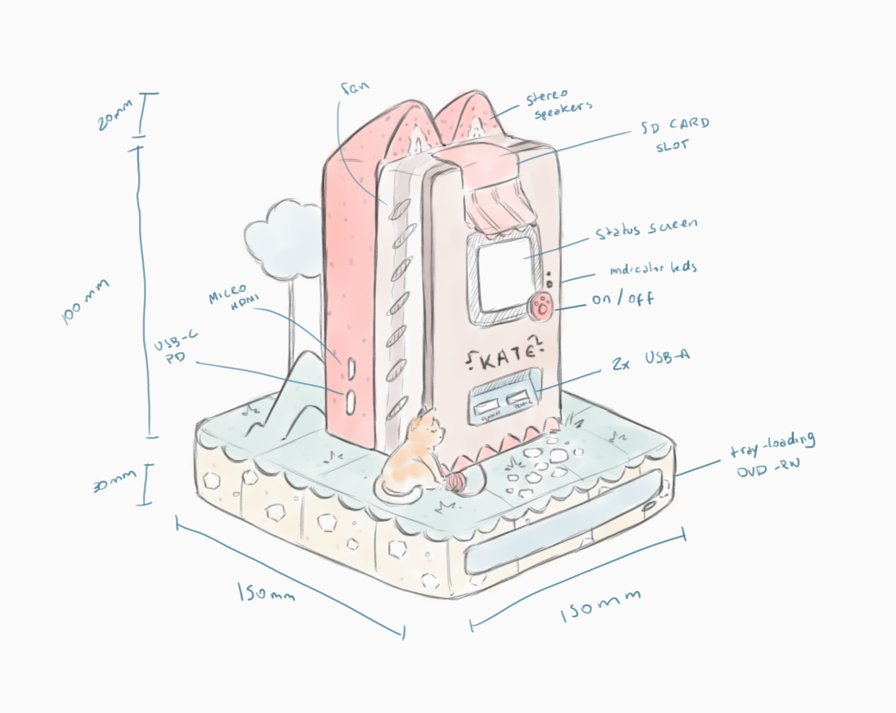
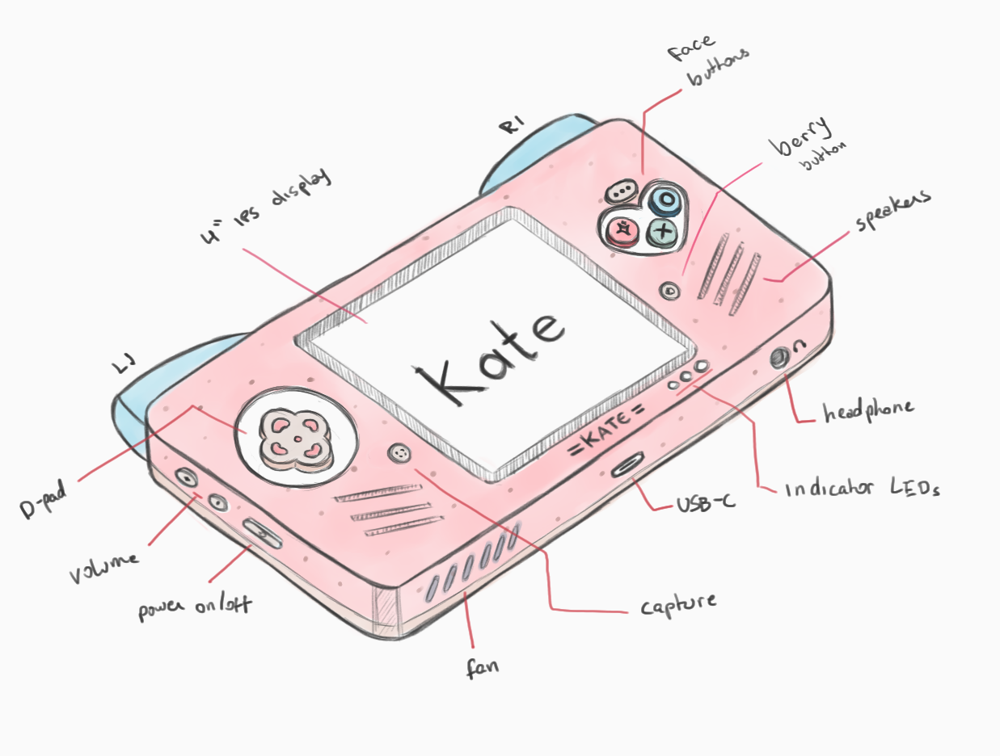
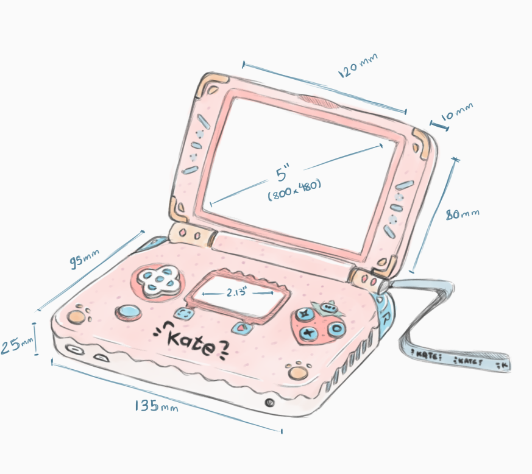

Overview
========

Before you start planning any DIY project, you need to know what you're going
to be building. Kate has a few proposed projects that fit the same "Kate
video game console", but can be customised to fit your own aesthetics and
wishes.

What's Kate?
------------

Kate is a video game console with its own operating system and application
format, so it primarily only runs games that are made specifically for Kate.
There's also the possibility of emulating games that would otherwise
run on a browser if they meet certain requirements (e.g.: they don't require
internet connection to a remote server to run).

The main goals of Kate as a gaming system are:

* **To be hackable**: users should be able to modify any aspect of the system
  to suit their needs, from the hardware to the software to the aesthetics.
  To support this all of Kate is released under permissive open-source licences:
  MPL-v2.0 for code, and Creative Commons 4.0 for non-code resources.

* **To be understandable**: Kate is an open and layered system. It's intentionally
  kept reasonably small such that users can read and understand the entirety of
  what they're running. On top of that, we aim to provide full documentation of
  all features, together with their underlying formal (mathematical) model,
  security proofs, and complete threat models.

* **To be safe**: we encourage everyone to publish cartridges for Kate and also
  to play any cartridge they find interesting. To support this we need to provide
  a baseline of safety, and Kate does it by installing and running cartridges in
  fully isolated and sandboxed processes, with very few permissions. There's
  a modern `Capability-Security system <https://en.wikipedia.org/wiki/Capability-based_security>`_
  which takes care of letting cartridges do more while putting users fully in
  control of how much trust they want to put on the cartridge and which risks
  they're willing to take.

* **To be accessible**: we want as many people as possible to be able to build
  and run Kate, so the system should run with moderate resources and not require
  a large amount of money and time. We try to achieve this by making the system
  itself free, picking less expensive components as a recommended basis, and
  allowing people to run emulated versions of the Kate system on devices they
  already own --- all while supporting as much of the other goals as possible.

* **To be democratic**: anyone should be able to develop and publish games
  for Kate. And they should, ideally, be able to do so with tools they're already
  familiar with, too. Kate achieves this by making all development tools open,
  and by supporting web games to be emulated in the console even when playing
  it fully offline without any additional server software.

* **To be open**: it should be very difficult for a single party to control the
  system and its ecosystem. We try to make as much use of open and auditable
  standards as possible, as well as pick decentralised-first architecture
  designs for features that can have an impact on this (e.g.: the game catalog
  is fully decentralised, anyone can run one, and we rely on public key verification
  for determining trust and provenance).

* **To be by humans and for humans**: it's a specific goal of Kate that
  curation, suggestions, and similar be done by people, and for people.
  This is done in the game catalog, where people can create their own
  curation feed and others can subscribe to those feeds, but it also
  applies to features like the :ref:`Play Habits`, where we try to put the player
  in control of which data they want to store and *how* they want to process
  that data (i.e.: if they want suggestions based on them, they have to write
  programs that analyse and correlate the data themselves).

What does Kate look like?
-------------------------

Kate can look like anything you want --- that's the beauty of a hackable game
console. But if you want some inspiration, or just want something that will
work, the following are official designs for different Kate versions that
you can build, all based on the same Cats x Sweets x Strawberry theme.

.. note::

  3D models for the cases along with detailed build instructions are planned
  to be added to this document over the course of 2024, but they're not
  currently available. Also note that since the designs below are not final
  yet they are not available under any open licence.

The Cheesecake Vending Meow-chine
'''''''''''''''''''''''''''''''''

A small box that can play games, music, and other media, but which requires
you to connect to an external HDMI display in order to see or play anything.
Comes with stereo speakers for playing music directly, a small low-power
screen for displaying the current system status, and a CD/DVD drive to load
games distributed in physical media.

The Cheesecake version is by far the easiest project to build out of all of
them, as it requires no soldering, no batteries, and very few GPIO connections.
For controls, the Cheesecake can take both wireless and wired gamepads.

The Pink Paw-cake
'''''''''''''''''

A handheld console with a similar form-factor to classic consoles like the
PSP and the Gameboy Advance. A 5" screen is recommended (as the standard
minimum Kate games will consider when testing), but you can try a 4" one
if you want a more compact look and will be playing more pixel-art games
than visual novels.

The Pancake version is a more serious project, requiring wiring multiple
buttons, fiddling with ribbon cables in a small enclosure, and getting
batteries to work correctly.

The Purr-fect Cookie
''''''''''''''''''''

A handheld you can flip open and closed, like a laptop, or classic consoles
such as the Gameboy Advance SP or the Nintendo DS series. A 5" screen is
recommended (as the standard minimum Kate games will consider when testing),
but you can try a 4" one for a more compact look if you'll be playing more
pixel-art games than visual novels, or you can go up to a 6" or 7" screen
if you'd rather have bigger letters despite the bulkier form-factor.

The Cookie version is more cumbersome to build than the Pancake version. On
top of all issues you'll find while building the Pancake version, in the
Cookie version some components are located very far from the main board, and
you'll need to pass all of their connectors through the small hinge that
supports flipping the console open or closed.