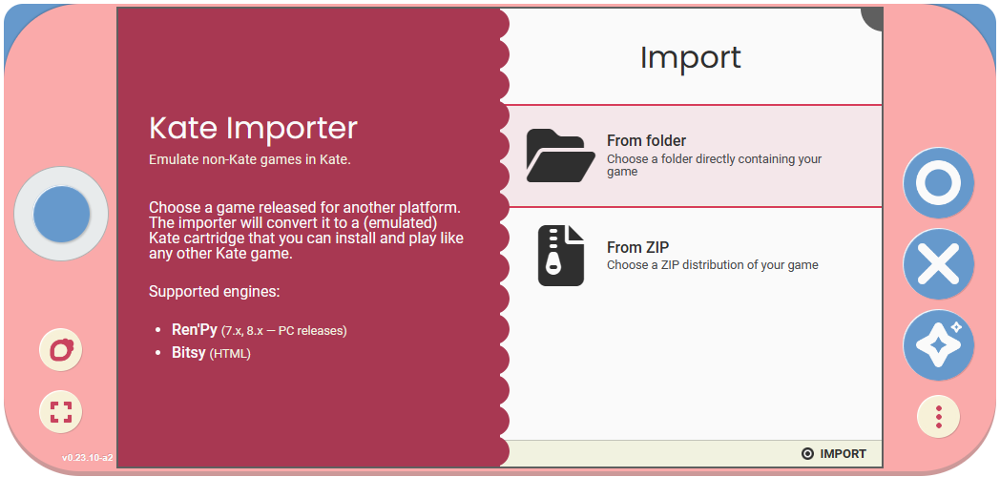

========================
The Kate Importer Manual
========================

.. warning::

  Kate and the Importer are still in development. This book is likewise
  a work  in progress.

The Kate Importer cartridge allows you to install and play games released
for other platforms in any Kate console or emulator. For example, you could
take a ZIP release of a game released for Windows and install it right in
Kate to play from your web browser — under the hood Kate uses different
emulation and translation techniques to make this possible.

.. important::

  The importer works by creating a cartridge from the game's contents and
  copying this cartridge into your console's storage. Some games' licence
  terms have provisions against copying their data to other locations than
  e.g.: the disc or media they were published in. You're still responsible
  for making sure your usage of the importer aligns with the EULA and
  other licences of the games you're importing.

  Cartridges installed by the Importer are explicitly marked ``unofficial``.
  As long as the original developers have not officially released the game
  for Kate, you should treat all issues you see in an imported games as
  issues in the Importer. Do not bother developers with issues that are
  outside of their control and capacity to support.

  The Importer exists as a best-effort to get a game to run on your device
  through emulation, particularly for small and free indie games, but like
  all emulation it's ultimately not the experience the original developers
  designed for. Always remember to be kind and respectful towards their work!

Getting the Importer
--------------------

The Kate Importer is released as a standard cartridge. Download the
``standard-cartridges.zip`` file from either the
`GitHub releases page <https://github.com/qteatime/kate/releases>`_ or the
`Itch.io stable mirror <https://cute-the-niini.itch.io/kate-importer>`_. You'll
find the importer cartridge inside this ZIP file.

To install, you can drag-and-drop the ``kate-importer.kart`` file on a Kate
emulator, or use |btn_berry_text| to bring the context menu and select
``Install cartridge...``.

Capabilities
------------

The Importer needs two powerful capabilities (and a modal-dialog one):

* ``Ask to access your files``: this gives the Importer read-only access to
  the file you choose to share with the Importer. It's needed to be able to
  analyse the game's files and prepare a Kate cartridge for it.

* ``Ask to install cartridges``: this gives the Importer rights to ask you
  to install arbitrary cartridge files. It's needed to be able to install
  the cartridge created from the game files you provide.

Supported platforms and engines
-------------------------------

The Importer can only import games made for supported platforms or engines.
Currently there is support for:

* :doc:`Ren'Py <renpy>` (versions 7 and up)
* :doc:`Bitsy <bitsy>`

More supported engines and platforms to be added soon!

How does it work?
-----------------

The Importer uses a different strategy depending on the target game's engine
or platform. The most common strategy is code translation and emulation —
that is, Kate either patches the game's code to provide the features it
needs in Kate's own environment, or it emulates those features during the
game's execution.

Both of these strategies have performance limitations, and are not a
guarantee that the game will run exactly as it was meant to run in the
original platform it was released for. For example, some features in the
original platform might have no realistic equivalent in Kate. The best
way to check what you can expect is to read each engine or platform's
page from the supported list above.

.. toctree::
  :hidden:

  renpy
  bitsy