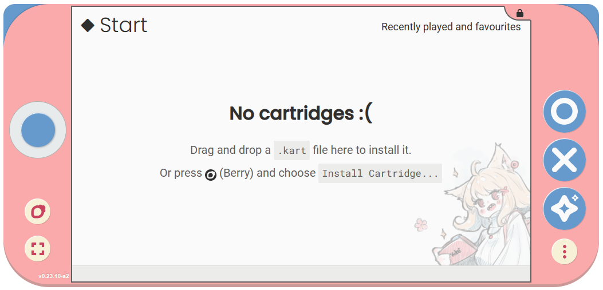
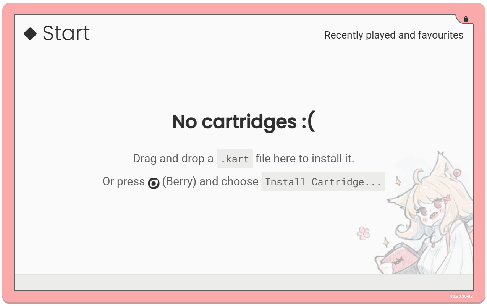
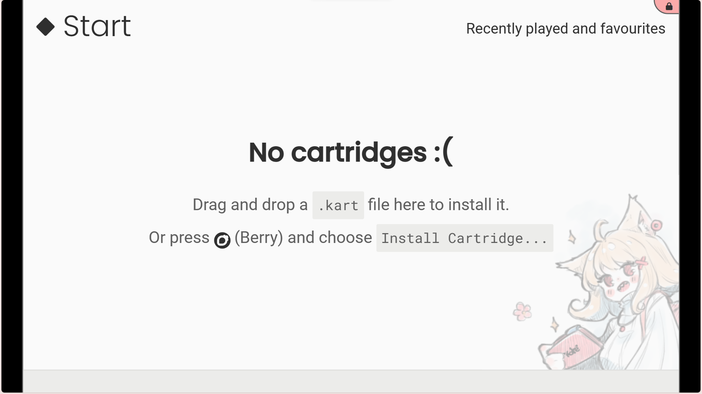

Emulator
========

The Kate emulator can transform any relatively modern (released later than 2015)
device with a modern web browser into a Kate console. In this case the
Kate features are limited by the features present in the device running
the emulator.

To run the Kate emulator, the device must still provide at least the same
:ref:`Computing Power <hardware computing power>` and the same
:ref:`Graphical Power <hardware graphics>` as the Kate physical
hardware.

That is, the recommended configuration is:

* **CPU**: 1.8GHz (quad-core) or 2.4GHz (quad-core);
* **RAM**: 2 GB+;
* **Storage**: 64 GB+;
* **Display**: 800x480 or higher;
* **GPU**: support for OpenGL ES 3.1;

Some simpler/smaller games may run in less powerful hardware as well.

Case modes
----------

The emulator supports different case modes, both for aesthetic purposes
and for device input purposes. You can change which case mode your
emulator uses by pressing |btn_berry_text|, then selecting
``Settings -> User Interface`` and picking from one of the three
available modes.

.. _emulator hand-held mode:

Handheld Mode
'''''''''''''

This is the default case mode for the Kate emulator, but it's optimised for
smartphones (and marginally for tablet devices). It includes virtual
buttons on the sides and on the top, which can be pressed on a touch-capable
device instead of requiring a physical gamepad or keyboard, and it tries to
maximise the area used for the screen as much as possible. This is also why
it uses a thumbstick instead of the usual D-Pad (you can hold the thumbstick
and move it like you would a regular analog thumbstick, but without the
nice physical feedback).

In handheld mode the screen resolution is locked to 800x480. The recommended
host device's resolution must be at least 1040x490 pixels to be able to house
the whole emulator UI comfortably. In devices with a smaller screen resolution,
the emulator will scale down the UI favouring speed, which might result in
lower image quality.

TV Mode
'''''''

The TV case mode is optimised for devices that have a fairly big screen
resolution (e.g.: 1600x900 pixels) but also have some sort of physical
input device connected, such as a keyboard or a gamepad.

In TV mode you can choose between 800x480 and 1200x720 as the emulator
screen resolution. Your device's screen resolution will need to be at
least 60 pixels larger than that horizontally and vertically in order
to fit the emulator UI comfortably.

Fullscreen Mode
'''''''''''''''

In fullscreen mode the screen takes the whole space available for the
emulator. It has the same resolution options as the TV mode:
800x480 and 1200x720 pixels.

.. note::

   When running Kate's native mode distribution it's not possible to
   switch between fullscreen and TV/handheld modes from Kate's settings.
   Instead, if you want to run Kate in fullscreen mode, you'll need to
   launch the emulator with the fullscreen flag: ``--fullscreen``.

Input
-----

Kate supports several different input methods. Games are encouraged to
provide alternative inputs so the game is still playable even if your device
doesn't support all of the input methods.

Pointer input
'''''''''''''

Kate supports pointer inputs (mouse, trackpad, stylus, touch, etc).
If your device has any pointer input device connected, you'll be
able to control games that offer pointer input options.

Kate buttons
''''''''''''

Kate has 12 digital input buttons which are used to control most games.
In the emulator you can:

**Use the virtual buttons**
   In hand-held mode, if you have a device with
   a touch screen, like a smartphone or tablet, you can touch the virtual
   buttons to control Kate. You'll need to select hand-held mode from
   ``Settings -> User Interface``.

**Use your keyboard**
   You can configure the how the keyboard keys map to
   Kate buttons from ``Settings -> Controllers & Sensors -> Control Kate
   with a keyboard``. The default is arrow keys for the |btn_dpad_text|;
   ``Left Shift``, ``Z``, ``X``, and ``C`` for |btn_menu|, |btn_ok|,
   |btn_cancel|, and |btn_sparkle|; ``A`` and ``S`` for |btn_l| and |btn_r|;
   ``F`` for |btn_capture_text|, and ``Q`` for |btn_berry_text|.

   .. image:: img/keyboard.png

**Use a standard gamepad**
   You can configure how the gamepad maps to Kate
   buttons from ``Settings -> Controllers & Sensors -> Control Kate with
   a standard gamepad``. By default, the gamepad's buttons are mapped to
   the Kate buttons at a similar position, with the left joystick doubling
   as a D-Pad.

   .. image:: img/gamepad.png