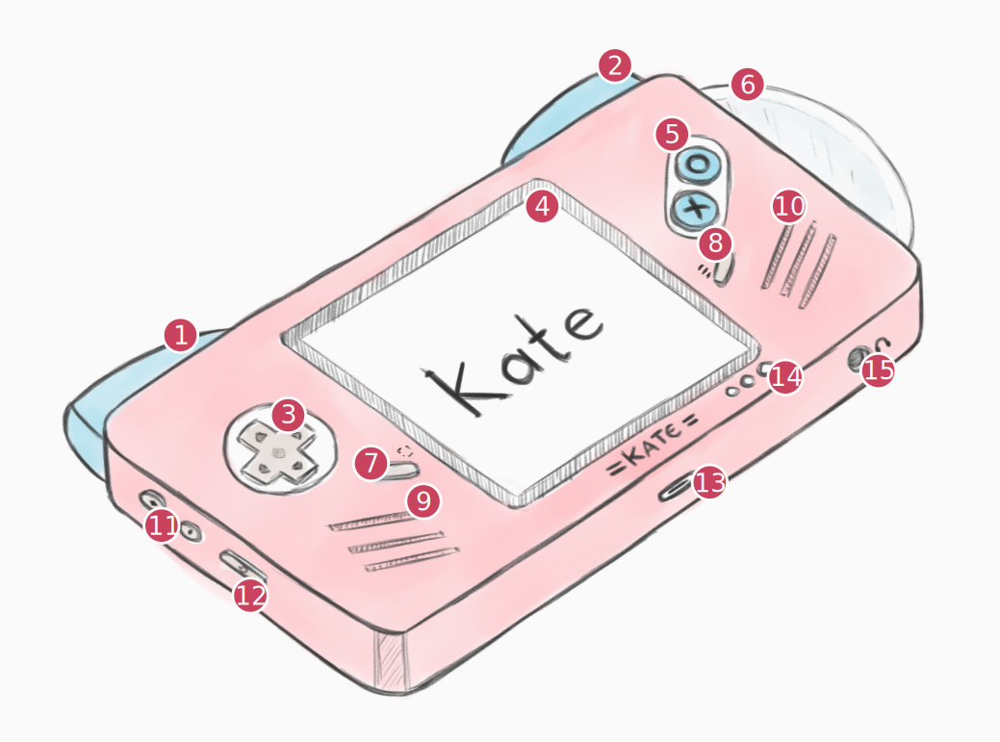

Tech specs
==========

The console
-----------

Kate is a handheld console that uses 2020s technology to recreate some
of the feelings of early 2000s and 2010s technology. It sports a cat-themed
case, specific security feedback channels, and a slot-loading mini-disc drive!

====== =======================================================================
 Item  Description
====== =======================================================================
\(1\)   Left shoulder trigger (|btn_l|)
\(2\)   Right shoulder trigger (|btn_r|)
\(3\)   D-Pad (|btn_dpad|)
\(4\)   4" capacitive touch screen (800x480, 5:3)
\(5\)   Face buttons: |btn_cancel| (*a.k.a. "Cancel"*) and |btn_ok| (*a.k.a. "Ok"*)
\(6\)   Slot-loading mini CD/DVD drive (or SD card slot)
\(7\)   |btn_capture_text|
\(8\)   |btn_menu_text|
\(9\)   Left speakers
\(10\)  Right speakers
\(11\)  Volume buttons (+, -)
\(12\)  Power/Sleep button
\(13\)  USB Type-C port
\(14\)  Device status, Trust indicator, and Resource indicator leds
\(15\)  Headphone jack
====== =======================================================================

.. _hardware computing power:

Computing power
---------------

Kate is available in different versions, with increasing cost and computing
power capabilities. For requirements, games will include the lowest version
needed to play the game, as well as the recommended version.

============= ======================== ======================== ========================
\             Crystal (Casual)         Paper Lantern (Regular)  Phantom (Powerful)
============= ======================== ======================== ========================
**CPU**       1.4GHz (4 cores)         1.8GHz (4 cores)         2.4GHz (4 cores)
**RAM**       1 GB                     2 GB                     4 GB
**Storage**   32 GB                    64 GB                    128 GB
============= ======================== ======================== ========================

.. _hardware graphics:

Graphics
--------

Kate uses 4" capacitive multi-touch (10 points) display with a resolution
of 800x480. When connecting to an external display, it can reach the maximum
resolution of 1280x720. The screen aspect ratio is 5:3.

The GPU supports `OpenGL ES 3.1`_.

.. note::

   When running the emulator, this means that your GPU card should have
   at least been released after 2012, and have updated drivers that
   provide the needed functionality.

.. _OpenGL ES 3.1: https://en.wikipedia.org/wiki/OpenGL_ES#OpenGL_ES_3.0_2

Input
-----

Kate has a total of 8 digital input buttons and 2 analog buttons used for
controlling games:

* |btn_ok| *(Ok)* and |btn_cancel| *(Cancel)* face buttons;
* |btn_dpad| *(D-Pad)*;
* |btn_capture_text| and |btn_menu_text|;
* |btn_l| and |btn_r| analog triggers;

It also has a capacitive touch screen with support to 10 touch points,
a haptics module for vibration, a 3-axis gyroscope sensor, and a 3-axis
accelerometer sensor.

Up to 4 gamepads can be connected to the console at a time, either through
bluetooth or directly through USB.

Cartridges
----------

Games for Kate can be made with many different technologies, and are shared
as ROM files, which Kate calls a "cartridge". These cartridges can contain
up to 512 MB of data [#f1]_. Because Kate includes a mini CD/DVD drive, one
inexpensive form of sharing and archiving these games offline is to burn
them to a mini CD/DVD.

Kate never runs the ROM files directly; rather they're copied into the
console in a more efficient format upon installation. From that point on,
as long as you don't archive the game in Kate, it can be played without
needing to keep the file around or insert the disc [#f2]_.

.. [#f1] There are plans to lift the 512 MB limitation in the future, but
   it requires reworking the cartridge format first.

.. [#f2] Kate cartridges contain no form of :term:`copy-protection`, and rather
   rely on players being respectful of game developers' wishes regarding
   sharing and modifying the game—such wishes are included in the cartridge's
   metadata.

