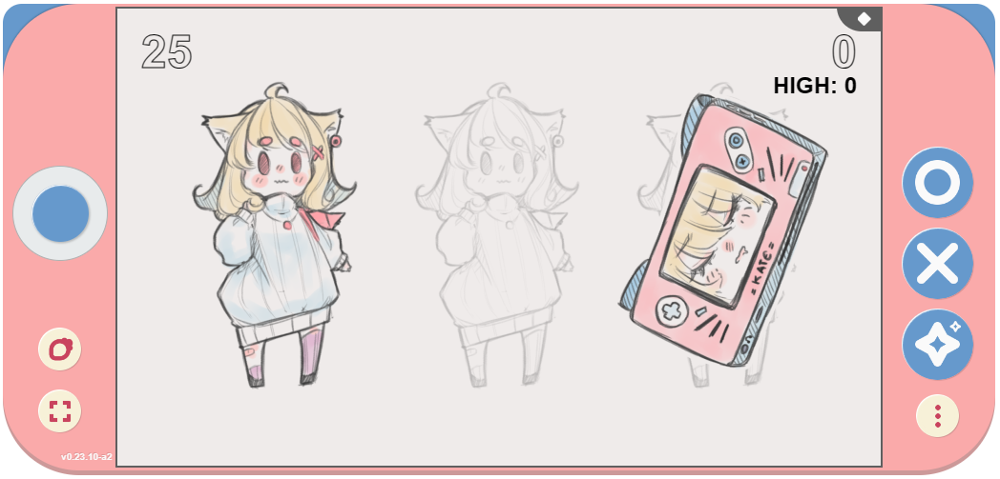
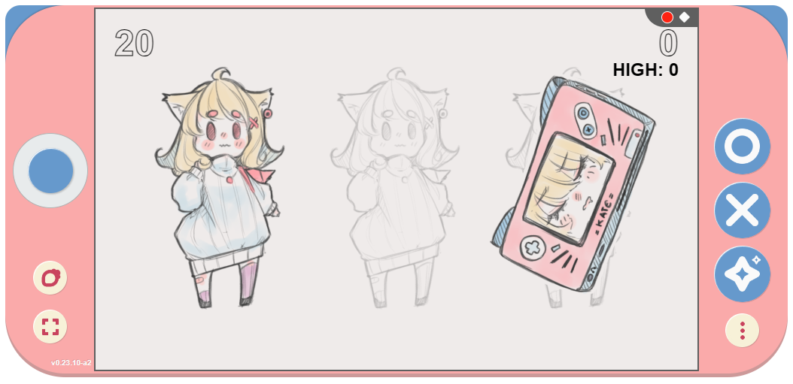
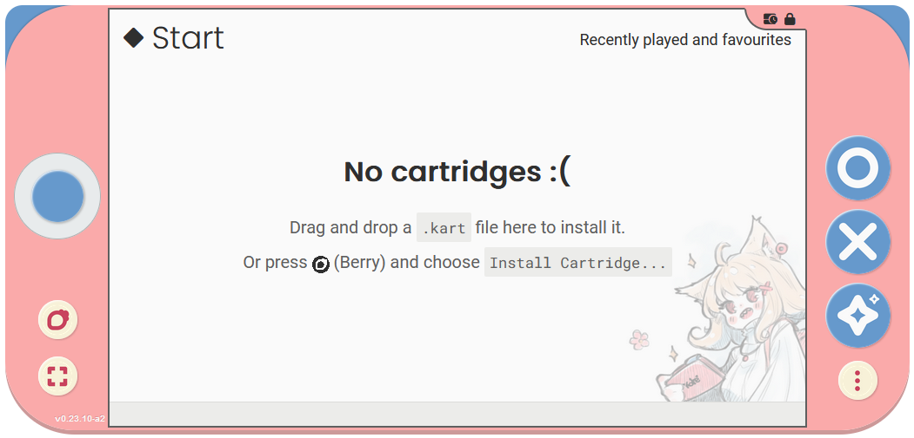

Trust and consent
=================

Sometimes there will be things happening in Kate which require your
attention. This is often the case with dangerous or irreversible
actions, such as deleting things from the database. But it might
also arise from things that have more of a potential for harm,
such as recording videos from a Kate screen.

For these cases Kate relies on the resource indicator to communicate
what's happening and what level of risk you're currently taking. The
resource indicator is designed to make it impossible for any cartridge
to mimic, so you can always trust that the information comes from the
trusted Kate code.

The resource indicator bar
--------------------------

The indicator bar is a small bar of icons that's always displayed on the
top-right of the screen in Kate. For example, if you launch a cartridge
you might notice a small diamond icon in this bar:

This indicates that Kate is currently showing you a regular cartridge
screen, and that screen is not necessarily subject to the same privacy
policy and security guarantees that Kate has, so you should be more
cautious about what information you share with it.

On the other hand, when Kate shows you a screen that comes from Kate's
own code, you'll see this same bar with a distinct pink background and
a padlock where the diamond icon would be. When this happens you can
be assured that any interaction you have on that screen and any
information you share will be subject to Kate's privacy policy and
security guarantees.

.. image:: img/trusted.png

Background actions
------------------

Besides indicating whether you can trust that the current screen comes from
Kate's own code or not, the resource indicator bar also houses other icons
to show things happening in the background in the console. For example,
when Kate is recording your screen you'll see a small "recording" icon
in this bar. Any other background action that might pose some risk will
likewise be shown there.

Icons for background actions are shown in the bar simply for informational
purposes, so you can make more informed risk assessments. They don't
require any action from your side.

Warning icons
-------------

Sometimes your Kate installation or the device configuration will be in a
status that might pose a risk to your data. For example, if you're running
low on storage space it might not be possible to save your game. Or, if 
you're running Kate without persistent storage, cartridges that you install
might be gone when you close the emulator or turn off your Kate device.
For these cases you'll see a warning icon in the screen, and you can use
the resource icon table in this page for suggested actions.

For example, in the image above the console is running without persistent
storage (e.g.: this may happen if you run it in an anonymous window, or if
you run it in Chrome without installing Kate as a web app):

.. _resource indicator icons:

Resource icons
--------------

+-----------------------+-----------------------------------------------------+
| Icon                  | What is it used for?                                |
+=======================+=====================================================+
| |icon_tmp_storage|    | **Temporary storage**                               |
|                       |    Used in the web version of Kate to               |
|                       |    indicate when the emulator is operating on a     |
|                       |    `Best-Effort storage mode`_, and so the browser  |
|                       |    may decide to erase the console data if you      |
|                       |    start running out of space.                      |
|                       |                                                     |
|                       |    Adding to favourites or                          |
|                       |    :ref:`installing as a web app <Web Application>` |
|                       |    may solve the issue in Chrome and Safari.        |
|                       |    In Firefox you'll need to grant the              |
|                       |    "Persistent Storage" permission to the page.     |
+-----------------------+-----------------------------------------------------+
| |icon_low_storage|    | **Low storage**                                     |
|                       |   Used to indicate that the device's storage has    |
|                       |   very little free space, which might impact all    |
|                       |   of Kate's functions that store data.              |
|                       |                                                     |
|                       |   :term:`Archiving` or                              |
|                       |   :doc:`deleting data </user/manual/gaming/storage>`|
|                       |   is advised.                                       |
+-----------------------+-----------------------------------------------------+
| |icon_recording|      | **Recording screen**                                |
|                       |    Used to indicate when a cartridge is currently   |
|                       |    recording the screen using the provided Capture  |
|                       |    API.                                             |
+-----------------------+-----------------------------------------------------+
| |icon_gc|             | **On-going storage cleanup**                        |
|                       |    Some actions will not delete files from your     |
|                       |    storage right away to optimise your storage      |
|                       |    lifetime and improve Kate's robustness.          |
|                       |                                                     |
|                       |    Files that are not used anymore by Kate will be  |
|                       |    cleaned up regularly by a "garbage collection"   |
|                       |    process. You don't need to do anything, but this |
|                       |    process might slow down with more intensive      |
|                       |    applications while it's running.                 |
+-----------------------+-----------------------------------------------------+
| |icon_temp_file|      | **Reading/Writing temporary files**                 |
|                       |    When cartridges are reading or writing           |
|                       |    temporary files, this icon will be shown.        |
|                       |    These files pose no privacy or security risk,    |
|                       |    but if an application is using too much of your  |
|                       |    storage space for temporary files, you can       |
|                       |    change its limit for temporary file storage      |
|                       |    in the cartridge's permissions screen.           |
+-----------------------+-----------------------------------------------------+

.. |icon_temp_file| image:: img/icons/temp-file.png
  :width: 32px

.. _Best-Effort storage mode: https://developer.mozilla.org/en-US/docs/Web/API/Storage_API#bucket_modes

Note on non-visual cues
-----------------------

Currently Kate uses only visual cues for the trust frame. This is a problem
for players who have certain vision disabilities and rely on other output
channels, such as a screen reader. In the future Kate will expand these
security feedback channels to non-visual channels as well, but that requires
more research and experiments.