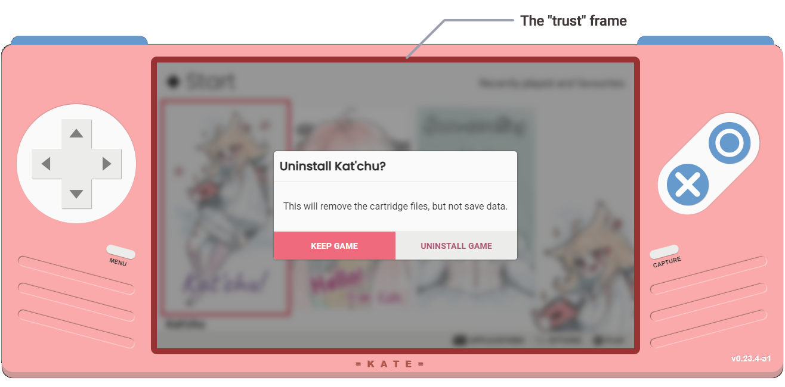
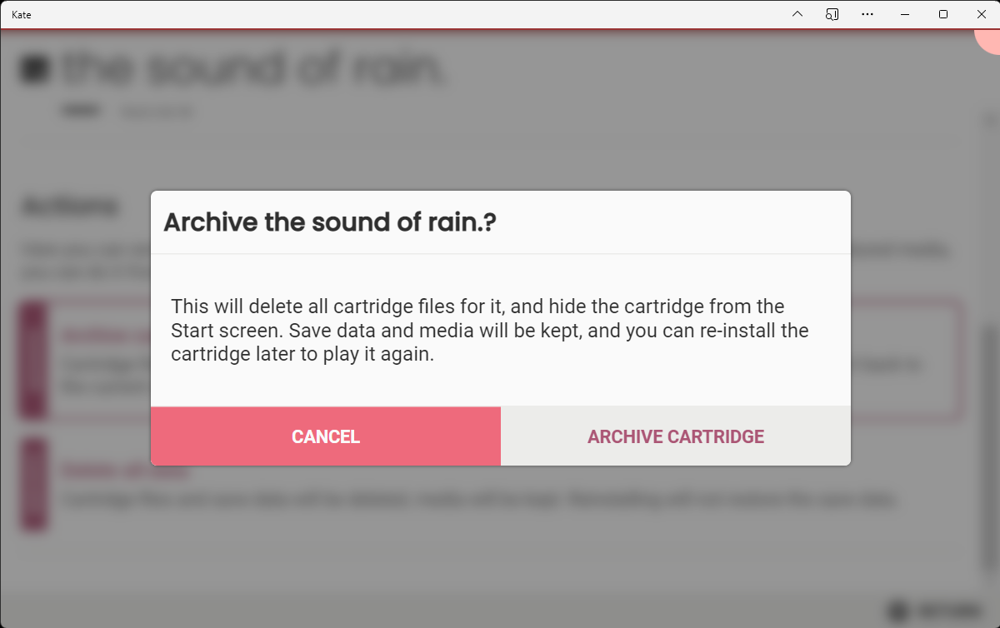

Trust and consent
=================

Sometimes you will take actions in Kate that require consent. This is
generally the case with dangerous or irreversible actions, such as
deleting data from the database. But it might also arise from things
like granting access to files or more storage space for a cartridge.

When the emulator prompts you for consent in these cases, there will
be a distinctive indicator (called the "Trust Frame") to show that the
request is truly coming from the Kate emulator, and not from a malicious
cartridge mimicing the same UI.

Hand-held and TV modes
----------------------

In hand-held and TV mode, this distinct indicator takes the form of
a red-ish border surrounding the screen. In this case the dialog
is coming from the Kate emulator because there are no black borders
between the console's case and the screen:

Because the border around the screen is outside of the screen the
cartridge has access to show things on, there's no way for a cartridge
to mimic this indicator.

Fullscreen mode
---------------

When running Kate in fullscreen mode, the trust frame takes a different
shape. It's indicated by a 3 pixels tall contiguous line at the very
top of the screen, along with the :doc:`resource indicator band <indicators>`
at the top-right. Like the trust frame in hand-held and TV modes, the
one in fullscreen mode will also change colour when a dialog
presented on the screen to get your consent comes from Kate itself.

Because the trust indicators in fullscreen mode are always on top of the
screen, there's likewise no way for a cartridge to mimic it, so you will
always know what dialogs are trustworthy and which ones are presented
by the cartridge when you look at the trust frame.

Note on non-visual cues
-----------------------

Currently Kate uses only visual cues for the trust frame, and the cues
are colour-based. This is a problem for colour-blind players, and it
may be a problem for players who have another vision disability or
cannot look at the screen for one reason or another.

A future version of Kate will expand these channels to non-visual and
non-colour-based ones as well, but that requires more research on
forms of communicating this information through non-visual channels
in ways that can't be mimic'd.