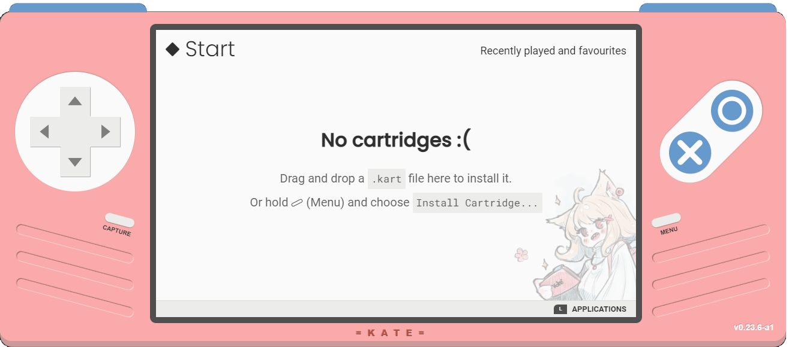
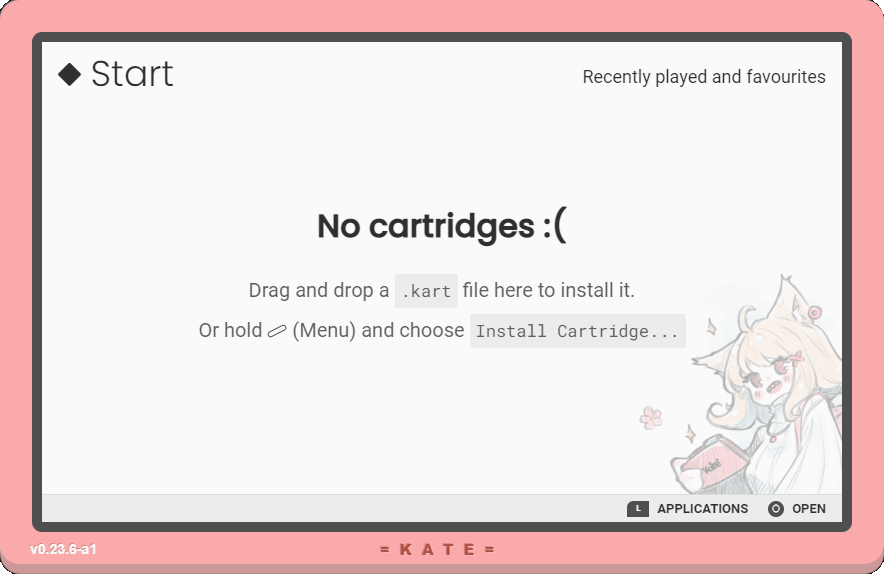
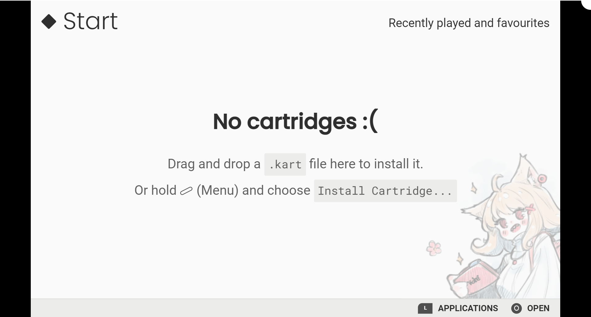
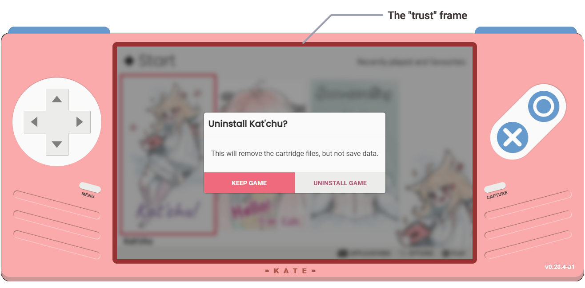
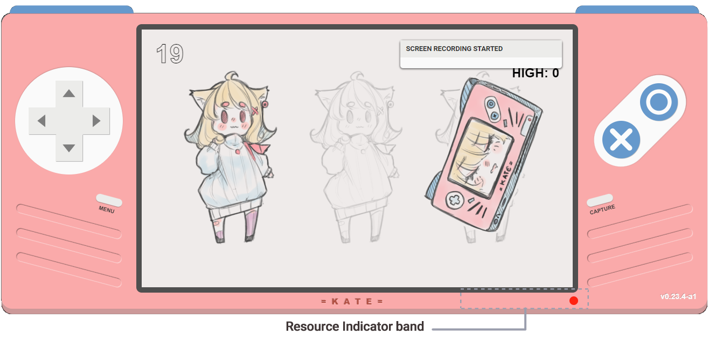

# The Kate Manual

> **NOTE**: This is a living document. Information here applies to Kate v0.23.4

Kate is a fantasy hand-held console for small 2d applications, particularly RPGs, Visual Novels, and similar story-driven games. As a fantasy console, games are generally run in an emulator program—the current emulator can run as a native application in Windows, Linux, and MacOS, as well as in a modern web browser (supporting Android, Steam Deck, and other devices).

Kate is an accessibility, security, and privacy conscious platform. We want players to be in control of their gaming experience, and we want to make sure they have a fun (and safe!) time playing regardless of what cartridge they choose to run.

This manual describes the underlying technology Kate uses, so you have a better idea of how it achieves these safety and privacy goals. As well as what features it provides.

For information on how to make games for Kate, see [Making games for Kate!](./dev-manual.md).

## Hardware specification

|                        |                                                                                        |
| ---------------------- | -------------------------------------------------------------------------------------- |
| **Console case**       | 16cm width x 7cm height x 3cm depth <small>(1310px x 570px in the emulator)</small> |
| **Display**            | capacitive touch screen, 4" (86x51 mm, 5:3 aspect ratio)                            |
| **Display resolution** | 800x480 in handheld mode; 800x480 and 1200x720 in TV/fullscreen mode                |
| **CPU**                | 1GHz\*                                                                                 |
| **RAM**                | 512 MB\*                                                                               |
| **Internal storage**   | 128 GB\* (8 GB reserved for OS)                                                        |
| **Cartridge limit**    | 512 MB                                                                                 |
| **Digital input**      | D-pad, 6-buttons (O, X, L, R, Menu, Capture)                                           |
| **Sensors**            | Accelerometer\*\*, Gyroscope\*\*                                                       |
| **Sound**              | Stereo speakers, 3.5mm headphone jack, bluetooth\*\*                                   |
| **Programming**        | Web technologies (JavaScript, HTML, CSS, WebAssembly)                                  |

**Note**:

\*Hardware speed is not limited in the emulator, but the emulator ticks at 30 FPS

\*\*For emulator users, the real device must provide these pieces of hardware.

## Controls

| Button                    | Name    | Keyboard   | [Standard gamepad][std-gamepad]                                             |
| ------------------------- | ------- | ---------- | --------------------------------------------------------------------------- |
|     | D-Pad   | Arrow keys | Left D-pad (12 to 15) Left thumbstick (axes 0 and 1)                     |
|       | Ok      | Z          | Rightmost right button (1) <small>(e.g.: A on SNES, B on XBox)</small>   |
|   | Cancel  | X          | Bottom-most right button (0) <small>(e.g.: B on SNES, A on XBox)</small> |
|        | L       | A          | Left bumper (frontmost) (4)                                                 |
|        | R       | S          | Right bumper (frontmost) (5)                                                |
|     | Menu    | Left Shift | Right special button (9) <small>(e.g.: Start on SNES, Menu on XBox)      |
|  | Capture | Left Ctrl  | Left special button (8) <small>(e.g.: Select on SNES, View on XBox)      |

Kate also supports controlling the emulator by touching/clicking the virtual buttons in the emulator application. For the bumpers, it's enough to touch anywhere near the top left/right corners of the emulator; you should see the button highlighted or moving on the screen when you do.

You can also use off-the-shelf gamepads with Kate. The button layout matches the one described in the [Gamepad][std-gamepad] specification. Numbers here refer to the buttons described there.

### Context menu

You can bring up the context menu by holding `Menu` for one second. The context menu provides useful commands for the current emulator context, which either be "OS" or "In-Game context".

> **NOTE:**  
> Bringing the context menu while in-game will pause the game. Note that for games not designed especifically for Kate, "pause" mostly means that none of the button input will be forwarded to the game window; the game will continue running normally otherwise.

In the "OS" context you can:

- **Power off**: closes the emulator (only available in the **Native** mode);
- **Fullscreen**: puts the emulator in or out of full-screen mode. Mostly useful in mobile phones where the screen is partly taken by address bars and such;
- **Install cartridge**: installs a cartridge from a `.kart` file (see [Kate Cartridges](#kate-cartridges) for details);

In the "Game" context you can:

- **Close game**: closes the game and returns to the OS context;
- **Fullscreen**: puts the emulator in or out of fullscreen. Note that you can't put just the game in full-screen for now;
- **Legal notices**: opens the licenses and other important legal information for the current game;
- **Media gallery**: opens the media gallery filtered by screenshots and videos for the current game;

### Screenshots and captures

You can take a screenshot of a game that has opted to support it by pressing the `Capture` button once. You can start recording a video by holding the `Capture` button for one second. Hold it again for another second to stop recording and save the video.

Both screenshots and videos are stored in the emulator, counting towards the cartridge's storage usage. Through the Media Gallery application you can view them, delete them, and download to your device's files from there.

> **NOTE:**  
> Kate is not always recording, so holding the capture button to save the last N seconds as a video, which is common in other consoles, does not currently work. This is a feature that will be added to the emulator in the future.
>
> Audio is, likewise, not currently recorded with the video, but will be in a future version.

## Kate modes

The Kate emulator is distributed in multiple forms (called "modes"), and they have slightly different capabilities:

- **Native Application**: the [Electron][] based emulator you can install as a native app on Windows, Linux, and MacOS;
- **Web Application**: the online emulator you can run by accessing https://kate.qteati.me
- **Single Application**: a special version of the emulator packaged with a single game for developers to publish on a platform like Itch.io.

The **Web Application** mode has limited functionality and may require you to touch or click the emulator at least once before gamepad support, audio, and other features are enabled.

The **Single Application** mode cannot install games, it's designed to run a single cartridge that is bundled with it. As a player, this is not a mode you download to play other games, but it's one you may come across online outside of https://kate.qteati.me.

You can always check which mode the emulator is running by going to `Applications -> About Kate` and checking the `System` section.

> **NOTE:**  
> Due to privacy restrictions in browsers to avoid tracking and fingerprinting, the `Host` and `Hardware` sections cannot be made accurate in the **Web** and **Single** modes. If you experience problems running Kate in these modes, please attach some additional information about the browser and device you're using when reporting the issue.

## Kate cartridges

Games for Kate are packaged in a special binary format called a Kate Cartridge (with the `.kart` extension). Cartridges contain the complete data for a video game or application that runs, sandboxed, in Kate. You can think of it like a ROM in other common emulators.

You install games by dragging cartridge files from your computer and dropping them on top of the Kate emulator. In devices where dragging files is not easily achievable, like in mobile phones, you can install cartridges by holding down `Menu` for one second, and then selecting `Install cartridge`. This will open up a file picker where you can choose the `.kart` file to install.

You can uninstall games by focusing them in the `Home` screen, then pressing `Menu` and choosing `Uninstall`. Uninstalling will remove the cartridge meta-data and files, but will leave behind save files and screenshots/videos captured from that game.

Kate limits cartridges to a maximum size of 512MB. This is close to what you would get if the game was packaged as a CD in the 2000s. It's a reasonable choice given Kate's hardware limitations, but also helps users have more space to install games. Sharing (space) is caring!

Once installed you can run the game at any time without needing to keep the `.kart` file around. However, it's good to keep your `.kart` files in some backup storage (such as a CD, an external hard disk, or in cloud storage) so that you can delete games that you're not actively playing anymore to make up space on your device, and later come back to them by re-installing from the same cartridge file.

### What's sandboxing?

Kate cartridges are sandboxed for security. This means that, by default, cartridges in Kate can do five things:

- Read files that were packaged with the cartridge (but only those files!);
- Play sounds through your device's audio output;
- Display things on the small 800x480 piece of screen made available to them by the emulator;
- React to your input, provided to the cartridge in terms of Kate buttons pressed or released;
- And store very small amounts of data, of up to 64MB, used for save files.

For anything else, the game will need to ask you for permission, and you may choose to allow them to do it (if you trust the cartridge enough), or not. This is not much different from how your phone requires applications to ask for permission to use the camera or microphone, Kate just takes it a bit further to protect privacy as well.

Unlike phones, note that Kate does not allow cartridges to make any online connections by default. This is both for privacy (e.g.: a cartridge would not be able to profile your device to track you elsewhere), and for security (e.g.: many malicious applications steal sensitive information and need to send it somewhere on the internet).

By doing this Kate makes it possible for you to download a `.kart` file from anywhere, install it in a Kate emulator, and play the game without being as careful with it as you would have to downloading a native executable. If the cartridge turns out to be malicious in the end, as long you don't give it more permissions than the default ones there isn't much damage it can do.

> **IMPORTANT NOTE:**  
> In the **Single Application** mode there are no security or privacy guarantees that Kate can make. That's because whoever is distributing the Kate emulator to you controls those guarantees instead. You'd have to trust that they're upholding all of the guarantees we describe here first.

## Case modes

The emulator supports a few different case modes, which you might want to change depending on your device's screen size and input device.

You can change the emulator's case mode at any point by going to `Applications -> Settings -> User Interface`, and then picking one of the three available modes (and maybe changing the screen resolution).

### Handheld mode

This is the default case mode for the Kate emulator. It includes virtual buttons on the sides and on the top, which can be used as a replacement for a physical gamepad in a device with touchscreen capabilities.

In handheld mode, the screen resolution is locked to 800x480.

### TV mode

Similar to the handheld mode case, but without any virtual buttons. This case is appropriate for running the emulator in laptop, or when connected to an external display or TV. You'll need a connected gamepad or keyboard to be able to control the emulator and play games.

In TV mode you can choose between 800x480 and 1200x720 as the screen resolution.

### Fullscreen mode

In this mode there's no emulator chrome (i.e.: no case around the screen), and the emulator takes up the entire available screen space.

Because Kate needs some space to display [security indicators](#resource-indicators), in this mode 3 pixels at the top of the screen are used by Kate for the trust mode indicator, and resources are always displayed on the top-right. These are displayed above the game screen, so might partially cover some of the game's content. Since it's a security mechanism, there's no way to disable it.

The resolutions available to fullscreen mode are the same as the TV mode ones.

> **NOTE** 
> For Kate's Native Mode distribution it's not possible to switch between windowed and fullscreen mode from the console's settings. Instead, if you want to run Kate in fullscreen mode you'll need to launch the emulator with the fullscreen flag (`--fullscreen`).

### Screen resolution and scale

The screen resolution you can configure in the UI settings is the size Kate applications and games render the contents in, but not necessarily the size you see on your screen.

If you choose a resolution that's higher than the amount of space available in the screen, Kate will down-scale the screen and the emulator to make it fit in the screen. This is useful for phones and other mobile devices, where it's harder to guarantee that there will be available space for the emulator.

Conversely, if you choose a resolution that's much smaller than your available screen size, Kate will not up-scale the emulator to fit the screen by default. You'll need to explicitly turn on this option in the UI settings. The reason for this is that up-scaling can produce blurry images.

## KateOS applications

Kate comes bundled with a few applications for managing installed games and captured media. Currently it consists of:

### Home

The Home screen lists all games installed in the console, sorting them from mostly recent installed/played to least recent. You can use () to select a cartridge. () will bring up a list of things you can do with it, and you can run a cartridge by touching its cover art, or by pressing () when it's focused.

Pressing () takes you to the Applications list.

### Media Gallery

The Media Gallery screen lists all screenshots and videos you've captured (potentially filtered by a specific game). You can use () to select one of the files, and () to open it.

Once opened, you can delete or download the file by pressing () and choosing the respective option there. Bulk deletions are not currently supported, but planned for a future version.

### About Kate

The About Kate screen displays the version of Kate you're running and other information about your device, which you can then use when reporting an issue in the emulator to help diagnosing the problem.

This page also contains the "Third Party licences", which tells you what software and assets are included in Kate, and how they're licensed to you; as well as the "Release Notes" for the version you're running, which tells you what features were added, changed, or removed, and what bugs were addressed in it.

### Settings

The settings screen allows you to view and change many of the aspects of the Kate emulator, such as display resolution, gamepad and keyboard input mapping, or what data gets recorded when you play games.

## Storage and privacy

In Kate, data is only ever stored locally, on your device. The Kate emulator itself never sends any of your data over the internet, although cartridges might **if** you give them network access, which is disabled by default.

There's four kinds of data about the cartridges you run that are stored:

- **The cartridges' data**: this is the data from the cartridges themselves. Kate copies the data from the cartridge into your local storage in a format that's more efficient and memory conscious for running games.

  The Kate emulator can read any cartridge's data, but each cartridge can only read its own files; for cartridges, it's as if no other cartridge existed in the console.

  Cartridge data is never modified; it is a read-only format. It might, however, be deleted if you choose to uninstall a cartridge.

- **The additional cartridge data**: these are things like save files and other pieces of data associated with a particular cartridge. Games can store any piece of data up to their storage quota (by default, 64 MB), and they may ask you to increase their quota as well.

  Each cartridge can read, modify, and delete its own additional data, but never other cartridge's data.

  The Kate emulator can delete this additional data on your request, but it will delete _all_ of it or none of it, to ensure that cartridges never see inconsistent data they stored.

- **The cartridge captures**: these are screenshots and gameplay recordings of cartridges in Kate. Screenshots and captures are only created from your own action: if you don't press the capture button, there will be no captures created. Kate does not impose a limit on how many captures you can store, it's only limited by your own device's own storage.

  The Kate emulator can read and modify capture data (e.g.: for re-encoding videos), however it never **changes** or deletes the data without your explicit action.

  Cartridges cannot read, modify, or delete this data. Even if they were captured from the cartridge itself. However, in the future, you'll be able to selective share your captures with the cartridge.

- **The gameplay habits**: these are things like when a cartridge was last executed on the emulator, or how many hours you've spent running a cartridge. Kate collects this data by default and stores locally. It's used by Kate only for sorting and filtering cartridges in your library.

  The Kate emulator will read this data when displaying cartridges, and will modify it both when you run a cartridge and when you close it. It also updates play time every 10 minutes of game play.

  Cartridges cannot read, modify, or delete this data. Even data about its own play habits.

## Resource indicators

Computers often do things (and very dangerous things) without providing any feedback to the user. For example, you might want to know when a computer is using the microphone, or the camera, or similarly privacy-impacting resources.

The Kate emulator deals with this using what it calls a "resource indicator". These are a set of different visual cues in the interface that cannot be mimic'd by cartridges running in the Kate emulator, thus you can trust them to be a real indication of dangerous or important things that are happening in the emulator.

There are two kinds of resource indicators today:

### The `trust` frame

Sometimes the Kate emulator will prompt you for dangerous actions (e.g.: removing files or granting permissions). To make sure these requests are truly coming from the Kate emulator, and not from a malicious cartridge, Kate will have a distinctive border around the screen during such requests.

With the default theme, this is a red-ish border that surrounds the screen, so you should see no black borders between the console's case and the screen. The screenshot below illustrates this:

> **NOTE** 
> In Fullscreen display mode, the trust frame is a little line at the very top of the screen, and has a lighter pink colour. In this mode you can tell that you're looking at a trusted dialog if there's a pink line with no white line above it at the very top of the screen.

### The resource indicators

Sometimes the Kate emulator has to tell you that something is happening behind-the-scenes in the console, but it's difficult to do so in a less intrusive way. We also want to make sure we do this in a way that cartridges cannot tamper with or mimic, because it's used, among other things, to tell you when Kate is using your microphone or recording your screen.

The way Kate deals with this is through the Resource Indicator band, a small section at bottom right of the console's case that contains small icons describing dangerous or important things happening in the console at that point in time.

Note that dangerous actions are _always_ auditable independently, by looking at the audit log in the console. The resource indicators just provide a quick view of what's happening.

> **NOTE** 
> In Fullscreen display mode, the resource indicators are displayed at the top-right of the screen.

Kate currently uses the following resource icons:

| Icon                               | What is it used for?                                                                                                                                                                                                                                                                                                                                                              |
| ---------------------------------- | --------------------------------------------------------------------------------------------------------------------------------------------------------------------------------------------------------------------------------------------------------------------------------------------------------------------------------------------------------------------------------- |
|  | **Temporary storage**. Used in the [Web Application mode](#kate-modes) to indicate when the emulator is operating on a [Best-Effort storage mode](https://developer.mozilla.org/en-US/docs/Web/API/Storage_API#bucket_modes), and so the browser may decide to erase the console data if you start running out of space. Adding to favourites or installing as a web app may help |
|        | **Low storage**. Used to indicate that the device's storage is very low, which might impact all Kate's functions that store data. Archiving or deleting data is advised.                                                                                                                                                                                                          |
|          | **Recording screen**. Used to indicate when a cartridge is currently recording the screen through the Kate Capture API.                                                                                                                                                                                                                                                           |

---

> Some of the icons used by Kate are from [Fontawesome](https://fontawesome.com/), (c) Fonticons 2023, licensed under CC-By 4.0. Full license information can be found in [LICENCES.txt](https://github.com/qteatime/kate/blob/main/packages/kate-core/LICENCES.txt) in the kate-core folder.

[std-gamepad]: https://www.w3.org/TR/gamepad/#remapping
[electron]: https://www.electronjs.org/
